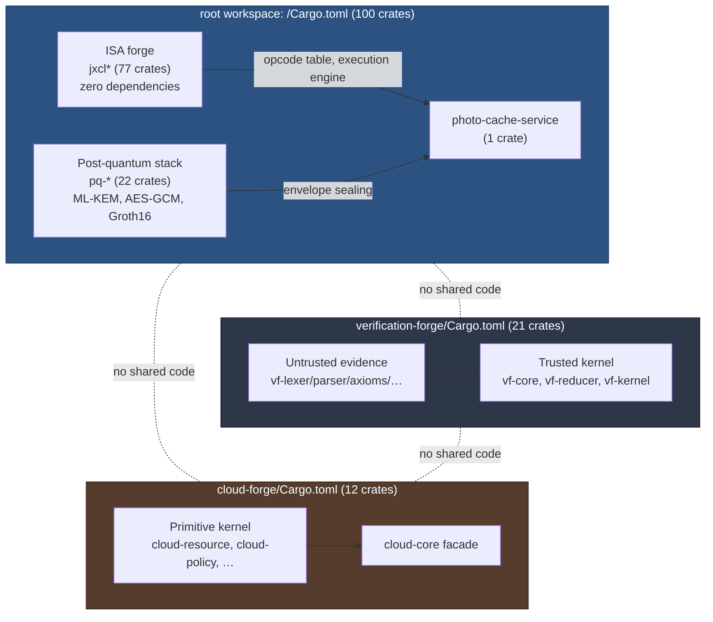
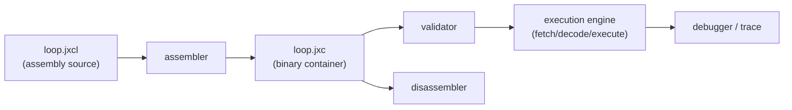
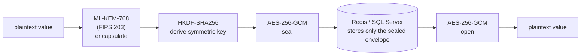
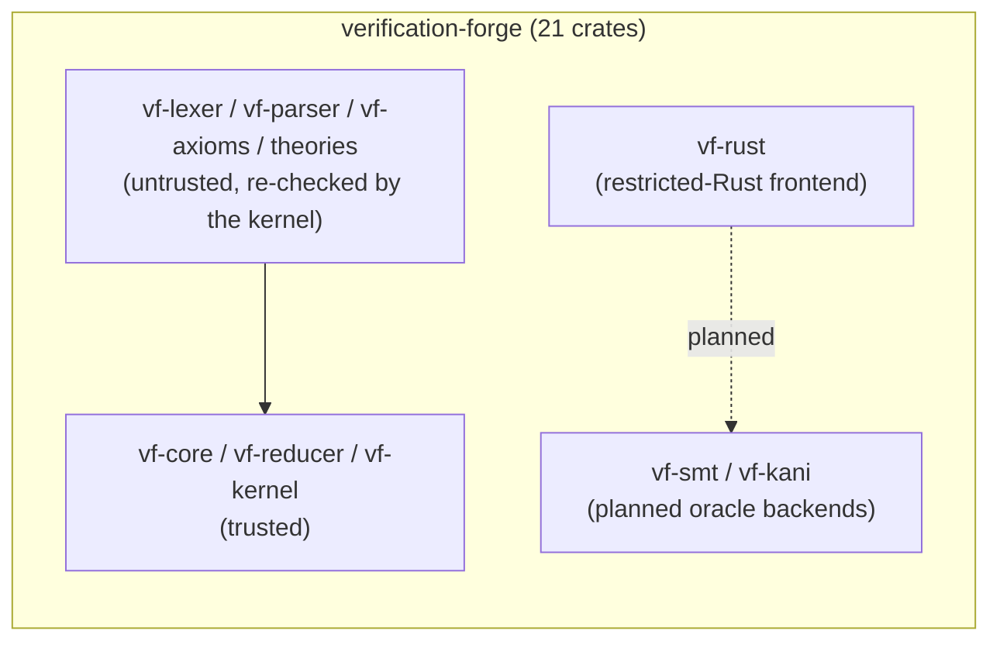
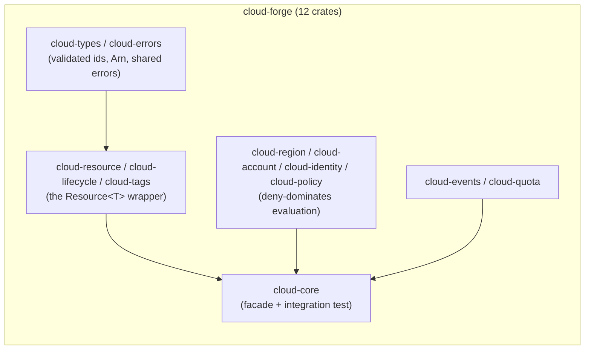

# tlm-jxcl-forge


**TLM JXCL** — a from-scratch, deterministic, byte-addressable 64-bit
instruction-set architecture and toolchain, grown into a 100-crate Rust
workspace covering the ISA itself, a post-quantum-encrypted caching and
storage stack, and zero-knowledge error attestation. Alongside it live
two fully independent workspaces: `verification-forge`, a from-scratch
formal verification kernel, and `cloud-forge`, a from-first-principles
cloud-resource substrate (build the primitives an AWS-shaped platform
would need, before any service-named crate exists). Every crate is
real: either genuine new functionality, or code extracted verbatim from
this repository's original six-crate baseline into its own
independently-testable module — never a thin wrapper padding a
headline number.

## Table of contents

- [Origins](#origins)
- [Repository map](#repository-map)
- [Getting started](#getting-started)
- [TLM JXCL: the instruction set (`crates/jxcl*`)](#tlm-jxcl-the-instruction-set-cratesjxcl)
- [Post-quantum cryptography and storage (`crates/pq-*`)](#post-quantum-cryptography-and-storage-cratespq-)
- [`photo-cache-service`: the reference caching demo](#photo-cache-service-the-reference-caching-demo)
- [SQL Server vault (`pq-sql-vault`)](#sql-server-vault-pq-sql-vault)
- [Verifiable error attestations (`pq-error-proof`)](#verifiable-error-attestations-pq-error-proof)
- [`verification-forge`: a from-scratch proof kernel](#verification-forge-a-from-scratch-proof-kernel)
- [`cloud-forge`: a from-first-principles cloud substrate](#cloud-forge-a-from-first-principles-cloud-substrate)
- [Why 100 crates, and how to trust that number](#why-100-crates-and-how-to-trust-that-number)
- [Networking, services, and cross-cutting concerns](#networking-services-and-cross-cutting-concerns)
- [Testing methodology](#testing-methodology)
- [Quality gates](#quality-gates)
- [Frequently asked questions](#frequently-asked-questions)
- [Contributing / development workflow](#contributing--development-workflow)
- [Documentation index](#documentation-index)
- [License](#license)

## Origins

TLM JXCL began as a single-crate, 3,500-line implementation
specification for a "pure raw dense" instruction-set architecture:
deterministic, byte-addressable, with no external dependencies in the
ISA itself. Around that core grew a post-quantum-encrypted caching
layer (a hardened Rust port of an original Express+Redis demo), a SQL
Server-backed alternative store, and a zero-knowledge error-attestation
scheme — six crates in total at that point. From there, an explicit
mandate to decompose the workspace into 100 single-invariant crates
(never fake ones — see [Why 100 crates](#why-100-crates-and-how-to-trust-that-number))
produced the root workspace as it exists today. `verification-forge`
began later and independently, as a from-scratch formal-verification
kernel with no dependency on anything ISA- or crypto-specific — hence
its own separate workspace rather than crate #101. `cloud-forge` began
later still, as an explicit from-first-principles attempt at the
substrate underneath an AWS-shaped cloud platform — again independent
of the other two, and again a separate workspace rather than more root
crates, for the same reason `verification-forge` is one.

## Repository map

This repository holds **two independent Cargo workspaces** that never
depend on each other:



| Workspace | Crates | What it is | Where to read more |
|---|---:|---|---|
| root (`/Cargo.toml`) | 100 | TLM JXCL ISA, post-quantum crypto/storage, zero-knowledge proofs, one reference service | this file |
| [`verification-forge/`](./verification-forge) | 21 | A from-scratch, Lean4/Kani-inspired formal verification kernel | [`verification-forge/README.md`](./verification-forge/README.md) |
| [`cloud-forge/`](./cloud-forge) | 12 | A from-first-principles cloud-resource substrate (Phase 1 of a much larger roadmap) | [`cloud-forge/README.md`](./cloud-forge/README.md) |

If you only came here for the formal-verification project, skip ahead
to [`verification-forge`](#verification-forge-a-from-scratch-proof-kernel)
or go straight to its own README.

## Getting started

All three workspaces build with a stable Rust 2021 toolchain and no
non-Rust build tooling (no `iverilog`/`yosys`, no `circom`, nothing
outside `cargo`):

```
# root workspace: ISA + post-quantum stack + one reference service
git clone <this repository>
cd tlm-jxcl-forge
cargo build --workspace
cargo test --workspace

# verification-forge: the formal-verification kernel (separate workspace)
cd verification-forge
cargo build --workspace
cargo test --workspace --release

# cloud-forge: the cloud-resource substrate (separate workspace)
cd ../cloud-forge
cargo build --workspace
cargo test --workspace --release
```

`pq-cache`'s integration tests spawn a real `redis-server`, and
`pq-sql-vault`'s are `#[ignore]`d by default (no live SQL Server in a
typical dev environment) — see [`docs/HARDENING.md`](./docs/HARDENING.md)
for how to run either against a real backend. Everything else —
`jxcl`, the 77 `jxcl-*` crates, `pq-error-proof`, and all 21
`verification-forge` crates — runs with nothing beyond `cargo test`.

To try the ISA toolchain end-to-end in under a minute:

```
cargo build --release -p jxcl
target/release/jxcl asm crates/jxcl/examples/loop.jxcl -o loop.jxc
target/release/jxcl run loop.jxc --trace
```

## TLM JXCL: the instruction set (`crates/jxcl*`)

A complete, deterministic, byte-addressable, 64-bit instruction-set
architecture and toolchain: opcode registry, encoder, decoder,
reference execution engine, ALU, memory subsystem, register/flag
subsystem, binary format, static validator, assembler, disassembler,
CLI, and a debugger/trace mode — plus unit, property, golden-vector, and
decoder-fuzz test suites. The original implementation was one crate
(`crates/jxcl`); it has since been decomposed into dozens of
single-invariant crates (see [Why 100 crates](#why-100-crates-and-how-to-trust-that-number)),
with `jxcl` itself kept as a facade that re-exports the same public API
so nothing downstream had to change.



- **Full architecture spec:** [`docs/ISA_SPEC.md`](./docs/ISA_SPEC.md)
- **Hardware/RTL integration contract:** [`docs/RTL_CONTRACT.md`](./docs/RTL_CONTRACT.md)
- **Example program:** [`crates/jxcl/examples/loop.jxcl`](./crates/jxcl/examples/loop.jxcl)

```
cargo build --release -p jxcl
cargo test -p jxcl

target/release/jxcl asm crates/jxcl/examples/loop.jxcl -o loop.jxc
target/release/jxcl validate loop.jxc
target/release/jxcl disasm loop.jxc
target/release/jxcl run loop.jxc --trace
```

`jxcl` subcommands: `asm <in.jxcl> -o <out.jxc>`, `disasm <program.jxc>`,
`run <program.jxc> [--trace] [--limit N]`, `inspect <program.jxc>`,
`validate <program.jxc>`.

Source layout (all under `crates/jxcl/`): `src/isa/` (constants,
registers, flags, opcode registry, operand model), `src/encoding/`
(encoder/decoder), `src/alu.rs`, `src/memory.rs`, `src/machine.rs` +
`src/execution.rs` (machine state and the fetch/decode/execute engine),
`src/control.rs` (branch semantics), `src/binary.rs` + `src/validator.rs`
(container format and static validation), `src/assembler/`
(lexer/parser/two-pass assembler), `src/disassembler.rs`,
`src/debugger.rs` (trace mode), `src/main.rs` (CLI). Tests live both
inline (`#[cfg(test)]` per module) and in `tests/` (property tests,
golden vectors, decoder fuzz).

The 77 `jxcl-*` crates that back this facade span seven categories —
Foundation, ISA, Execution, Memory, Toolchain, Debug/Simulation, and
Hardware/RTL — each documented in
[`docs/CRATE_ARCHITECTURE.md`](./docs/CRATE_ARCHITECTURE.md) with its
owned invariant, public API, and dependency direction. The Hardware/RTL
crates are worth calling out specifically: they generate real Verilog
and VHDL from the same opcode table the software decoder uses, and
mechanically cross-check that the generated decoder's case arms match
it — but this environment has no `iverilog`/`verilator`/`yosys`, so the
generated RTL is checked against golden files, not simulated against
real hardware-simulation semantics. See
[`docs/HARDWARE_LIMITATIONS.md`](./docs/HARDWARE_LIMITATIONS.md) for
exactly where that honesty boundary sits.

## Post-quantum cryptography and storage (`crates/pq-*`)

A Rust port of the original `redis-implementation-js` demo (an Express
server illustrating Redis-backed HTTP response caching), hardened for
production and decomposed into 22 crates so the post-quantum
cryptography is an independent, fully unit-tested building block rather
than something bolted onto the HTTP layer.



- **`pq-crypto`** implements ML-KEM-768 (the NIST FIPS 203 standardized
  post-quantum key encapsulation mechanism, formerly CRYSTALS-Kyber) +
  HKDF-SHA256 + AES-256-GCM as a hybrid envelope encryption scheme, with
  key rotation via `KeyRing` (`Active`/`DecryptOnly`/`Retired` key
  versions). See its module docs for the full construction and threat
  model. Internally this crate is now itself a facade over
  `pq-kem`/`pq-kdf`/`pq-aead`/`pq-envelope`/`pq-keyring`/`pq-rotation`.
- **`pq-cache`** wraps an async Redis client so that every value is
  sealed with `pq-crypto` before being written and opened after being
  read — Redis itself never sees plaintext. A corrupted or
  undecryptable entry degrades to a cache miss rather than an error.
- **`photo-cache-service`** provides two binaries mirroring the
  original demo (details in the [next section](#photo-cache-service-the-reference-caching-demo)).

`pq-crypto` and its dependents are themselves decomposed into 22
single-invariant crates, each independently testable:

| Crate | Owns |
|---|---|
| `pq-kem` | ML-KEM-768 (FIPS 203) key generation and encapsulation/decapsulation |
| `pq-kdf` | HKDF-SHA256 expansion of the KEM shared secret into an AES-256 key |
| `pq-aead` | AES-256-GCM authenticated encryption/decryption of the plaintext |
| `pq-envelope` | The sealed-value wire format: key version, KEM ciphertext, nonce, AEAD ciphertext |
| `pq-keyring` | The `KeyRing` data structure — an indexed set of key-pair entries |
| `pq-rotation` | The `Active`/`DecryptOnly`/`Retired` lifecycle, kept separate from the ring itself |
| `pq-signature` | ML-DSA (FIPS 204 / Dilithium) signing and verification — authenticity, alongside `pq-kem`'s confidentiality |
| `pq-policy` | A `Policy` trait consolidating scattered checks (TLS-required-in-production, minimum key length) |
| `pq-storage` | The `SealedStore` trait both `pq-cache` and `pq-sql-vault` implement |
| `pq-cache` | The Redis-specific `SealedStore` implementation |
| `pq-object-store` | Chunked/streamed large-blob storage on top of any `SealedStore` |
| `pq-journal` | An append-only, length-prefixed write-ahead log with replay |
| `pq-ledger` | A tamper-evident, hash-chained audit ledger built on `pq-journal` |
| `pq-migration` | Applies `pq-sql-vault`'s `sql/*.sql` migrations in order and tracks what's applied |
| `pq-proof-types` | The backend-independent `ProofScheme` trait and shared `Attestation`/`Error` types |
| `pq-proof-registry` | Maps scheme-id strings to boxed `ProofScheme` implementations |
| `pq-proof-verifier` | A facade that looks up the right scheme and verifies, so callers never touch `arkworks` directly |
| `pq-proof-bench` | Criterion benchmarks for `attest()`/`verify()` throughput (dev-only) |
| `pq-attestation` | Combines `pq-envelope` sealing with a `pq-proof-types` attestation in one call |
| `pq-error-proof` | The concrete Groth16/`arkworks` circuit, registered as a `ProofScheme` |
| `pq-crypto` | Facade: re-exports `seal`/`open`/`KeyPair`/`Envelope`/`KeyRing`/`KeyStatus`/`Error` under their original paths |
| `pq-sql-vault` | The SQL Server-specific `SealedStore` implementation |

```
cargo build --release -p photo-cache-service

# start a local Redis (or point REDIS_URL at an existing one)
redis-server --port 6379 &

PORT=3000 ./target/release/server &
PORT=3001 REDIS_URL=redis://127.0.0.1:6379 CACHE_TTL_SECONDS=3600 ./target/release/server-cached &

curl localhost:3000/photos   # always fetches upstream
curl localhost:3001/photos   # first call: MISS (fetches + seals into Redis)
curl localhost:3001/photos   # second call: HIT (opens the sealed entry)
```

See [`docs/HARDENING.md`](./docs/HARDENING.md) for the production
hardening checklist and the post-quantum scheme's threat model/scope.

## `photo-cache-service`: the reference caching demo

Two binaries mirroring the original `server.js`/`server-cached.js`
demo: `server` (uncached, port 3000 by default) and `server-cached`
(PQ-encrypted-cache-backed, port 3001 by default), both exposing `GET
/photos` and `GET /healthz`, with structured `tracing` logs, env-var
configuration, request timeouts, and graceful shutdown on
Ctrl-C/SIGTERM.

Config (all optional, shown with defaults): `PORT` (3000 / 3001),
`REDIS_URL` (`redis://127.0.0.1:6379`, `server-cached` only),
`CACHE_TTL_SECONDS` (3600, `server-cached` only), `RUST_LOG` (`info`).

## SQL Server vault (`pq-sql-vault`)

An alternative to `pq-cache` for services that already run SQL Server:
same `pq-crypto` sealing, same `KeyRing` rotation, but backed by
`tiberius` (a pure-Rust TDS client) instead of Redis, with key-rotation
policy enforced by the schema itself — a filtered unique index
guarantees at most one `Active` key version at the database level —
rather than only by application code. See
[`crates/pq-sql-vault`](./crates/pq-sql-vault) for the schema
(`sql/001_schema.sql` onward) and Rust API, and
[`docs/HARDENING.md`](./docs/HARDENING.md) for why this crate's
integration tests are `#[ignore]`d by default (no live SQL Server in
this environment) and how to run them against a real one.

## Verifiable error attestations (`pq-error-proof`)

A Groth16 zero-knowledge circuit (BLS12-381/Jubjub, via `arkworks`,
pure-Rust and crates.io-only) proving that a published error-attestation
commitment was honestly opened for a specific, publicly-known error
context, without revealing the secret randomness that opens it:

```rust
use ark_std::rand::{rngs::StdRng, SeedableRng};
use pq_error_proof::{attest, verify, Params};

let mut rng = StdRng::from_entropy();
let params = Params::generate(&mut rng)?; // one-time setup; persist and share via to_bytes/from_bytes

let context = b"error_code=DECRYPT_AEAD_MISMATCH;key_version=7;envelope=deadbeef";
let attestation = attest(&params, context, &mut rng)?;

assert!(verify(&params, context, &attestation)?);
```

See [`crates/pq-error-proof`](./crates/pq-error-proof)'s module docs for
exactly what this does and does not prove, and
[`docs/HARDENING.md`](./docs/HARDENING.md) for why it exists (a
crates.io-only substitute for a circom-based approach, which this
environment's GitHub-blocking egress policy rules out).

## `verification-forge`: a from-scratch proof kernel

A completely separate, 21-crate Cargo workspace implementing a small
Lean4/Kani-inspired formal verification system: a trusted,
LCF-style type-checking kernel; a locally-nameless, hash-consed term
representation; a library of inductive types and their eliminators
(`Nat`, `Bool`, `List`, `Option`, `Either`, `Vector`, `Fin`); an
axiom/definition registry that never lets an axiom in silently; two
small worked-example theories (**"Elucidian Algebra"** and
**"Workerman's Calculus"** — original names for this project's own
scaffolding, explicitly **not** established mathematical disciplines);
and a restricted-Rust frontend (`vf-rust`) that is the first step
toward Kani-style program verification.



174 tests pass, clippy and fmt are clean, and every theorem the system
proves was checked by actually running its proof term through the
trusted kernel — never asserted or inferred from the fact that
something happened to typecheck upstream.

**See [`verification-forge/README.md`](./verification-forge/README.md)
for the full architecture, the twelve hard invariants this workspace is
built against, a worked inductive-proof example, and the current
roadmap** (external SMT/model-checking oracle backends and a CLI are
still pending).

## `cloud-forge`: a from-first-principles cloud substrate

A completely separate, 12-crate Cargo workspace attempting the
substrate underneath an AWS-shaped cloud platform: resource identity,
lifecycle, ownership, tagging, policy, events, and quota — the handful
of concepts every cloud service (compute, storage, database,
messaging, …) would reuse rather than reinvent. Its one governing rule:
**do not create one crate per AWS service; build the primitives once,
then compose services from those primitives.** No crate in this
workspace is named after an AWS product, and none will be until it is a
composition of already-real primitive crates.



This is **Phase 1 of a much larger, explicitly staged roadmap** (a
control plane in Phase 2, then compute/storage/database/messaging
primitives, and only then AWS-shaped services composed on top). 94
tests pass, clippy and fmt are clean, and `cloud-core`'s own
integration test provisions a tagged, policy-checked, quota-limited
resource end to end using nothing but the primitives in the diagram
above — proof the composition the governing rule demands actually
works, not just that each crate compiles in isolation.

**See [`cloud-forge/README.md`](./cloud-forge/README.md) and
[`cloud-forge/docs/CLOUD_ARCHITECTURE.md`](./cloud-forge/docs/CLOUD_ARCHITECTURE.md)
for the full 46-phase roadmap, what Phase 1 deliberately leaves out
(and why), and the crate-by-crate breakdown.**

## Why 100 crates, and how to trust that number

The root workspace's crate count grew from an original baseline of six
crates (`jxcl`, `pq-crypto`, `pq-cache`, `pq-sql-vault`,
`pq-error-proof`, `photo-cache-service`) to 100 under an explicit
mandate: **100 crates, none of them fake.** For a workspace whose
pre-expansion codebase totaled roughly 7,100 lines, that mandate rules
out padding the count with thin wrapper crates — the outcome it exists
specifically to forbid. Every crate in
[`docs/crates.toml`](./docs/crates.toml) (the machine-readable
registry; see [`docs/CRATE_REGISTRY.md`](./docs/CRATE_REGISTRY.md) for
the generated human-readable index) is tagged with how it came to
exist:

- **extraction** (37 crates) — real code moved out of one of the
  original six crates' existing modules, verbatim or near-verbatim,
  into its own independently-testable crate. Traceable 1:1 to a
  specific pre-expansion file.
- **new** (60 crates) — genuinely new functionality built for this
  expansion: a relocatable object-file format and linker, a page
  table, a branch-target unit, an interrupt controller, RTL codegen
  driven directly from the existing opcode table, ML-DSA signatures, a
  storage abstraction trait, a proof-scheme registry, a minimal RPC
  protocol, an audit ledger, and more.
- **facade** (3 crates) — `jxcl`, `pq-crypto`, and `pq-error-proof`
  keep their original names and public APIs as thin re-export layers
  over the crates they were split into, so nothing outside the
  workspace that depended on `jxcl::isa::opcodes` or
  `pq_crypto::KeyRing` had to change.

| Category | Crates | Built on |
|---|---:|---|
| Foundation | 8 | `std` only |
| ISA | 12 | Foundation |
| Execution | 10 | ISA, Foundation |
| Memory | 8 | Foundation |
| Toolchain | 12 | ISA, Memory, Execution |
| Debug/Simulation | 8 | Execution, Memory, Toolchain |
| Hardware/RTL | 8 | ISA (opcodes/constants), Execution (ALU) |
| Cryptography | 10 | `std` + audited crates.io only |
| Storage/Data | 7 | Cryptography |
| Zero-Knowledge/Proof | 5 | `std` + `arkworks` (isolated) |
| Network/Service | 7 | Debug/Simulation, Storage, Cryptography |
| Security/Observability/Integration | 5 | cross-cutting, depends down into every layer it audits |

See [`docs/CRATE_ARCHITECTURE.md`](./docs/CRATE_ARCHITECTURE.md) for
the full narrative (including the ownership-boundary rationale for
splits that could plausibly have been merged, and weren't) and
[`docs/DEPENDENCY_GRAPH.md`](./docs/DEPENDENCY_GRAPH.md) for the DAG
itself.

## Networking, services, and cross-cutting concerns

Beyond the ISA and crypto stacks, two smaller crate families exist
purely to give shared, single-owner homes to logic that used to be
duplicated across `photo-cache-service`'s two binaries and
`pq-sql-vault`:

| Crate | Owns |
|---|---|
| `jxcl-network` | Connection-string credential redaction, address/port parsing |
| `jxcl-http` | Shared HTTP client/server helpers: a timeout wrapper, error-to-status-code mapping |
| `jxcl-service` | Generic service scaffolding: graceful shutdown, the health-check endpoint pattern, startup logging |
| `jxcl-protocol` | A serde-serializable request/response protocol for remote `jxcl-machine` control (assemble/run/return trace) |
| `jxcl-rpc` | A minimal RPC server/client implementing `jxcl-protocol` over line-delimited JSON on TCP |
| `jxcl-security` | Cross-cutting secret-redaction, generalizing what used to be two independent implementations (a Redis URL redactor and an ADO connection-string redactor) into one shared, tested function |
| `jxcl-observability` | Metrics/span conventions (a `RequestSpan` helper, standard metric names) built on `jxcl-logging` |
| `jxcl-audit` | A structured audit-event schema and emission helper, distinct from `jxcl-logging`'s generic subscriber setup |
| `jxcl-isa-versioning` | ISA/binary-format version negotiation, so an old binary fails closed against an incompatible newer decoder rather than silently misdecoding |
| `jxcl-conformance` | The mechanical spec-vs-code check: verifies `docs/ISA_SPEC.md` and `docs/RTL_CONTRACT.md`'s stated facts against `jxcl-isa-schema` and the generated RTL |
| `jxcl-integration` | Integration-test-only crate exercising the full stack end to end: assemble → run in `jxcl-simulator` → seal/store in `pq-cache` → attest with `pq-error-proof` |

`jxcl-logging` vs. `jxcl-observability` vs. `jxcl-audit` is a
deliberate three-way split rather than one "telemetry" crate: each has
a different caller (anything that starts up; anything serving
requests; anything making a security-relevant decision) and therefore
a different reason to change independently of the other two.

## Testing methodology

No crate in this repository is considered done until it passes its own
tests, but "tests" spans several distinct techniques depending on what
a crate owns:

- **Unit tests** (nearly every crate) — the default; inline
  `#[cfg(test)]` modules next to the code they exercise.
- **Property tests** (`jxcl-determinism` and others) — randomized
  inputs checked against an invariant that must hold for *all* inputs,
  not just hand-picked examples (e.g. "encode then decode is the
  identity," "the same input always produces the same machine-state
  snapshot").
- **Golden vectors** (`jxcl-golden`, `jxcl-hardware-test`) — a
  checked-in, human-reviewable set of expected input/output pairs
  (assembled programs and their exact encoded bytes; generated
  Verilog/VHDL text) that a regression must reproduce byte-for-byte.
- **Decoder fuzzing** (`jxcl-fuzz`) — structured fuzz input thrown at
  the decoder specifically, since it's the boundary that has to accept
  attacker-controlled bytes and fail safely rather than panic or
  misinterpret them.
- **Mechanical conformance** (`jxcl-conformance`) — checks that the
  prose in `docs/ISA_SPEC.md`/`docs/RTL_CONTRACT.md` actually matches
  what the code does, so documentation drift is a test failure, not a
  silent lie.
- **End-to-end integration** (`jxcl-integration`) — exercises the full
  stack (assemble, execute, encrypt-and-store, zero-knowledge attest)
  in one test, catching interface mismatches no single crate's own
  tests would see.
- **Ignored integration tests requiring live infrastructure**
  (`pq-sql-vault`) — `#[ignore]`d by default because this environment
  has no live SQL Server, runnable explicitly against a real one; see
  [`docs/HARDENING.md`](./docs/HARDENING.md).

`verification-forge` uses a different, complementary methodology
appropriate to a proof kernel — see its own [testing
philosophy](./verification-forge/README.md#worked-example-proving-n--0--n-by-induction),
where the test *is* running a proof term through the kernel and
checking whether it's accepted or rejected as expected.

## Quality gates

CI (`.github/workflows/ci.yml`) runs three jobs on every push and pull
request against `main`:

- `cargo fmt --all -- --check`
- `cargo clippy --workspace --all-targets -- -D warnings`
- `cargo build --workspace --all-targets` and `cargo test --workspace`

98 of the root workspace's 100 crates carry `#![forbid(unsafe_code)]`
outright (the two exceptions link against system TLS/database client
libraries that require it at their own FFI boundary — see
[`docs/HARDENING.md`](./docs/HARDENING.md)); a workspace-wide grep for
`unsafe` finds zero blocks anywhere in this repository, including
`verification-forge`. `verification-forge` runs the same three gates
independently from its own directory (see [its
README](./verification-forge/README.md#building-and-testing)).

## Frequently asked questions

**Why two separate workspaces instead of one?** `verification-forge`
shares no code, no types, and no dependencies with the root workspace —
it is a general-purpose proof kernel, not something specific to the ISA
or the crypto stack. Keeping it as its own `Cargo.toml` means its build
graph, its MSRV, and its own quality gates never entangle with the
root workspace's, and either can be vendored or extracted on its own
later without surgery.

**Does the Hardware/RTL layer mean this project has taped out real
silicon?** No. The `jxcl-hdl`/`jxcl-verilog`/`jxcl-vhdl`/`jxcl-netlist`/
`jxcl-synthesis` crates generate real Verilog/VHDL text from the same
opcode table the software decoder uses, and a real (if intentionally
toy) structural synthesis pass runs over it — but nothing in this
environment simulates the output against real hardware-simulation
semantics, because no HDL simulator (`iverilog`, `verilator`) or
synthesis tool (`yosys`) is available here. The generated RTL is
checked against golden files and cross-checked mechanically against
the decoder's own case arms; it has not been simulated or synthesized
for a real target. See
[`docs/HARDWARE_LIMITATIONS.md`](./docs/HARDWARE_LIMITATIONS.md) for
the precise line between what is and isn't verified.

**Is the post-quantum cryptography audited?** The primitives
(ML-KEM-768, HKDF-SHA256, AES-256-GCM, ML-DSA) come from established,
independently-maintained Rust crates rather than being reimplemented
here; this project's own code is the envelope format, key-rotation
policy, and integration, not the underlying cryptographic
implementations. Read `pq-crypto`'s module docs and
[`docs/HARDENING.md`](./docs/HARDENING.md) for the precise threat model
before relying on this in a real deployment.

**What does `pq-error-proof` actually prove?** That a specific,
already-published commitment was honestly opened for a specific,
publicly-known error context — nothing about the *correctness* of the
error itself, and nothing about any property not explicitly encoded in
the circuit. See the crate's own module docs before assuming it proves
more than that.

**Are `verification-forge`'s "Elucidian Algebra" and "Workerman's
Calculus" real mathematics?** No — this is worth repeating outside that
workspace's own README too. They are original names invented for this
project's own worked-example theories, not references to any
pre-existing mathematical or scientific field. Every theorem proved
under them is exactly as strong as its kernel-checked proof term, no
more.

## Contributing / development workflow

This repository was built one crate at a time, each verified before
the next began — a pattern worth preserving for any further work:

1. Implement a crate (or a small group of tightly related crates)
   fully, including tests, before starting the next one.
2. Run `cargo test -p <crate> --release`, fix any failures.
3. Run `cargo clippy -p <crate> --all-targets -- -D warnings` clean.
4. Run `cargo fmt -p <crate>` and confirm `-- --check` is clean.
5. Run the full workspace test suite (`cargo test --workspace
   --release`, from the appropriate workspace root) to confirm no
   regressions elsewhere.
6. Only then move on to the next crate.

Both workspaces' CI (`.github/workflows/ci.yml` for the root workspace)
runs the same `fmt`/`clippy`/`build+test` gates on every push and pull
request — a change that fails any of them locally will fail in CI too.

## Documentation index

| Doc | Covers |
|---|---|
| [`docs/ISA_SPEC.md`](./docs/ISA_SPEC.md) | The full TLM JXCL architecture specification |
| [`docs/RTL_CONTRACT.md`](./docs/RTL_CONTRACT.md) | The hardware/RTL integration contract |
| [`docs/HARDWARE_LIMITATIONS.md`](./docs/HARDWARE_LIMITATIONS.md) | Exactly what the generated RTL is and isn't verified against |
| [`docs/HARDENING.md`](./docs/HARDENING.md) | Production hardening checklist, PQ threat model, ZK-proof scope |
| [`docs/CRATE_REGISTRY.md`](./docs/CRATE_REGISTRY.md) | Generated human-readable index of all 100 root-workspace crates |
| [`docs/crates.toml`](./docs/crates.toml) | The machine-readable crate registry the docs above are generated from |
| [`docs/CRATE_ARCHITECTURE.md`](./docs/CRATE_ARCHITECTURE.md) | The narrative behind the 6→100 crate decomposition |
| [`docs/DEPENDENCY_GRAPH.md`](./docs/DEPENDENCY_GRAPH.md) | The crate dependency DAG |
| [`docs/BASELINE.md`](./docs/BASELINE.md) | The pre-expansion (six-crate) baseline this decomposition is grounded in |
| [`verification-forge/README.md`](./verification-forge/README.md) | The formal-verification workspace: architecture, invariants, roadmap |
| [`cloud-forge/README.md`](./cloud-forge/README.md) | The cloud-resource-substrate workspace: crate index, what's implemented |
| [`cloud-forge/docs/CLOUD_ARCHITECTURE.md`](./cloud-forge/docs/CLOUD_ARCHITECTURE.md) | The full 46-phase roadmap, layering, and Phase 1 scope decisions |

## License

This repository is dual-licensed:

1. **Open source:** the GNU Affero General Public License v3.0
   (AGPLv3), reproduced verbatim in [`LICENSE-AGPL`](./LICENSE-AGPL).
   Unless you have a signed commercial license (below), your use of
   this code is governed solely by that file.
2. **Commercial:** a separately negotiated commercial license,
   available as an alternative for parties who cannot or do not wish
   to comply with the AGPLv3's copyleft terms. See
   [`LICENSE-COMMERCIAL`](./LICENSE-COMMERCIAL) for the licensing
   program template (a non-binding draft, not an executed agreement)
   and contacts.

See [`LICENSE-NOTICE`](./LICENSE-NOTICE) for the copyright holder and
a summary of how the two licenses relate,
[`COPYRIGHT.md`](./COPYRIGHT.md) for the full copyright notice, and
[`TRADEMARKS.md`](./TRADEMARKS.md) for trademark terms (separate from
the copyright licenses above). `verification-forge/` and `cloud-forge/`
each carry their own identical copy of this same license set, since
either could be distributed independently of the root workspace.
