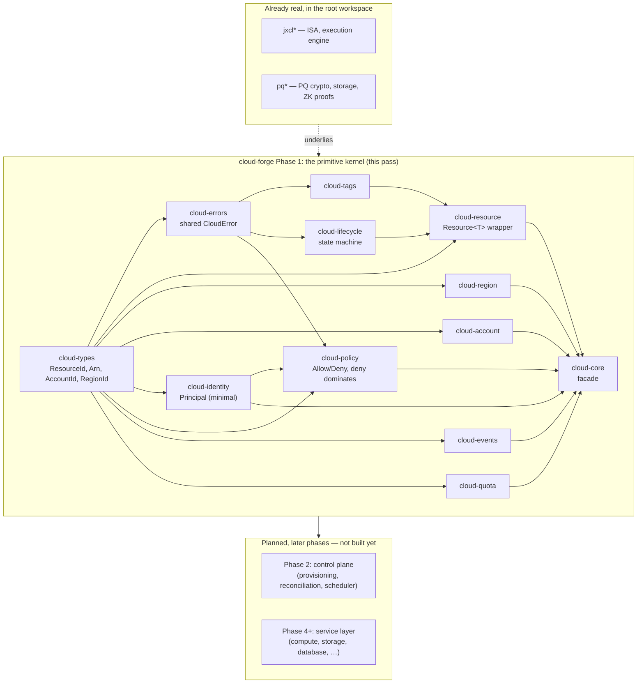

# cloud-forge architecture

## The non-negotiable rule

> Do not create one crate per AWS service. Build the primitives once,
> then compose services from those primitives.

`cloud-forge` is a from-first-principles attempt at the substrate
underneath an AWS-shaped cloud platform: resource identity, lifecycle,
ownership, policy, tagging, events, and quota — the handful of concepts
that every cloud service (compute, storage, database, messaging, …)
reuses rather than reinvents. No crate in this workspace is named after
an AWS product, and none will be until it is a thin composition of
already-real primitive crates, not a container for logic that belongs
in one of them.

This mandate carries the same weight as the root workspace's "100
crates, none of them fake" rule (see the repository root
[`docs/CRATE_ARCHITECTURE.md`](../../docs/CRATE_ARCHITECTURE.md)) and
`verification-forge`'s hard invariants: a crate exists here only when
it owns a real, independently-testable invariant.

## Why a third workspace

`tlm-jxcl-forge` already separates two independent Cargo workspaces:
the root workspace (the TLM JXCL ISA, post-quantum crypto/storage, one
reference service) and `verification-forge` (a from-scratch proof
kernel). Neither is a natural home for cloud-resource modeling:

- The root workspace's `docs/crates.toml` registry is machine-checked
  at exactly 100 crates with its own dependency-DAG rules
  (`tools/check_workspace.py`); folding an open-ended, many-phase cloud
  platform into it would either blow past that validated count or
  force cloud crates to misrepresent themselves as ISA/crypto crates.
- `verification-forge` is a general-purpose proof kernel with no
  cloud-specific concept in it at all — it will eventually *verify*
  invariants about `cloud-forge` (see "Relationship to
  verification-forge" below), which means it must stay independent of
  it, not host it.

So `cloud-forge/` is a third, independent top-level Cargo workspace,
with its own `Cargo.toml`, `crates/`, and quality gates — exactly the
same shape as `verification-forge/`.

## Layering



Every arrow above is a real `[dependencies]` edge in a crate's own
`Cargo.toml` — there is no crate in this phase that depends on
something not yet built, and no crate that exists only to be depended
on later without doing anything itself today.

## The resource model (Phase 0 / Phase 1)

Every cloud resource, regardless of which future service creates it,
carries the same fields — this is the one model every service composes
from rather than redefining:

| Field | Type | Owning crate |
|---|---|---|
| `id` | `ResourceId` | `cloud-types` |
| `resource_type` | `ResourceType` | `cloud-types` |
| `region` | `RegionId` | `cloud-types` / `cloud-region` |
| `account` | `AccountId` | `cloud-types` / `cloud-account` |
| `owner` | `AccountId` | `cloud-types` |
| `lifecycle` | `Lifecycle` | `cloud-lifecycle` |
| `version` | `u64` | `cloud-resource` |
| `tags` | `Tags` | `cloud-tags` |
| `created_at` / `updated_at` | `u64` (unix millis) | `cloud-resource` |

`owner` here means *account ownership* (who a resource bills to and
belongs to) — distinct from `cloud-identity::Principal`, which
`cloud-policy` evaluates access for. A resource-based policy attaching
a `Principal` to a specific resource is a Phase 13 (IAM) concept, not
pulled forward into this phase's `Resource<T>`.

`cloud-resource::Resource<T>` combines all of these plus a
service-specific payload `T`, so a future `Instance` or `Bucket` type
is `Resource<InstanceSpec>` / `Resource<BucketSpec>`, not a
hand-rolled struct that has to remember to include `tags` and
`lifecycle` correctly on its own.

The internal ARN format `cloud-types::Arn` implements is exactly the
one specified in the roadmap:

```
jxcl:cloud:<partition>:<service>:<region>:<account>:<resource>
```

## What Phase 1 deliberately does not include

- **`cloud-metadata` is not a separate crate.** Its proposed fields
  (`created_at`/`updated_at`/tags/version) are exactly `cloud-resource`
  and `cloud-tags`'s fields; a separate crate would own nothing a
  caller couldn't already get from those two.
- **`cloud-runtime` is deferred past Phase 2 too, now to Phase 4
  (compute primitives).** Phase 2 does add a scheduler, but what it
  schedules is *placement* (which `AzId` a resource is assigned to) —
  a decision `cloud-scheduler` owns directly using `cloud-types`'s
  existing `AzId`, with no new wrapper type needed. A "runtime" only
  becomes a real, distinct primitive once something is actually
  executing (a VM, a container, a function invocation) — Phase 4's
  concern, not Phase 2's.
- **`cloud-identity` is intentionally minimal in this phase**: a
  `Principal` enum (`User`/`Role`/`Service`, each carrying an id) —
  enough for `cloud-policy` to evaluate against. The full IAM surface
  (credentials, sessions, federation, policy documents-as-JSON) is
  Phase 13 in the roadmap and is not pulled forward.
- **No AWS-named crate exists anywhere in this phase.** `services/ec2`,
  `services/s3`, etc. cannot be started honestly until the primitives
  they'd compose (compute, storage, network primitives — later phases)
  are themselves real.

## Phase 2: the control plane

Phase 2 is where Phase 1's primitives stop being independent data
types and start composing into an actual pipeline: a request to create
a resource gets authorized, checked against quota, placed somewhere,
constructed, and recorded — with the whole operation succeeding
atomically or rolling back cleanly. This is also where the roadmap's
deterministic state machine

```
REQUEST -> AUTHENTICATE -> AUTHORIZE -> VALIDATE -> PLAN -> APPLY -> VERIFY -> COMMIT -> AUDIT
```

becomes a real, tested code path rather than a diagram. (`AUTHENTICATE`
is not separately modeled here: this phase takes an already-resolved
`Principal` as input, since credential/session verification is Phase
13's IAM surface, not Phase 2's control-plane concern.)

### What's real in Phase 2

| Crate | Owns |
|---|---|
| `cloud-scheduler` | Placement: picks the least-loaded `AzId` in a region, from `cloud-region`'s registry and a caller-supplied usage count per AZ |
| `cloud-service-registry` | A registry of named control-plane services and their health (`Healthy`/`Unhealthy`/`Unknown`) |
| `cloud-reconciler` | Given a current and a desired `Lifecycle`, computes the shortest valid transition path through `cloud-lifecycle`'s state graph (via BFS), or reports the desired state as unreachable |
| `cloud-provisioner` | The `AUTHORIZE -> VALIDATE -> PLAN -> APPLY -> VERIFY -> COMMIT -> AUDIT` pipeline itself, composing `cloud-policy` + `cloud-quota` + `cloud-scheduler` + `cloud-resource` + `cloud-events`, with each stage's failure distinguishable and every reservation made by an earlier stage rolled back if a later stage fails |
| `cloud-control-plane` | `ControlPlane<T>`: holds the account/region registries, policy, quota tracker, event log, and a resource store; exposes `create` (via `cloud-provisioner`), `get`, `list`, `delete` |

### What Phase 2 deliberately skips or defers

- **`resource-manager`, `lifecycle-manager`, `quota-manager`,
  `policy-engine`, `account-manager`, `region-manager` are not separate
  crates.** Each would be a thin wrapper doing nothing but forwarding
  to `cloud-resource`, `cloud-lifecycle`, `cloud-quota`, `cloud-policy`,
  `cloud-account`, or `cloud-region` — exactly the one-crate-per-name
  anti-pattern this workspace's non-negotiable rule exists to prevent.
  `cloud-control-plane` holds these Phase 1 primitives directly instead
  of through an extra indirection layer that owns nothing new.
- **`control-api` (a REST/gRPC layer) is deferred.** The roadmap's own
  execution order puts the API layer (Phase 30) well after the control
  plane it exposes; building an HTTP surface before the control plane
  it would serve is stable is building a service, not a primitive.
- **`cloud-runtime` is deferred to Phase 4** — see above.

### The rollback invariant

`cloud-provisioner`'s pipeline makes a real claim worth stating
explicitly: if `AUTHORIZE` succeeds but a later stage (`VALIDATE`,
`PLAN`, `APPLY`, or `COMMIT`) fails, every resource reservation an
earlier stage made (currently: `cloud-quota` usage) is released before
the pipeline returns its error. This is tested directly — not inferred
from "the individual stages are each atomic" — since a multi-stage
pipeline built from atomic parts is not itself atomic unless someone
wires the rollback path and verifies it.

## Phase 3: AWS-like resource identification

The roadmap names four crates for this phase: `cloud-arn`,
`cloud-resource-id`, `cloud-resource-parser`, `cloud-resource-registry`.
Three of the four already exist — just earlier than the roadmap's own
ordering expected, because the resource model itself needed them from
day one:

| Roadmap name | Where it actually lives | Since |
|---|---|---|
| `cloud-arn` | `cloud_types::Arn` — parses and formats `jxcl:cloud:<partition>:<service>:<region>:<account>:<resource>` | Phase 1 |
| `cloud-resource-id` | `cloud_types::ResourceId` | Phase 1 |
| `cloud-resource-parser` | `Arn`'s own `FromStr` impl — a separate parser crate would parse into the exact same `Arn` struct `cloud-types` already owns, with nothing new to own | Phase 1 (not a separate crate — see below) |
| `cloud-resource-registry` | **New this phase** | Phase 3 |

`Resource<T>` (Phase 1) has an id, a type, a region, and an owning
account, but nothing before Phase 3 ever assembles those into the
*canonical, fully-qualified name* for a provisioned resource, or lets
anyone look a resource up by that name rather than by its bare
`ResourceId`. That's what this phase adds:

- **`cloud-resource-registry`** owns exactly one thing: an `Arn` ↔
  `ResourceId` mapping. It rejects a second registration of an
  already-used ARN, and (a stricter, deliberate choice beyond what the
  roadmap specifies) rejects registering the same resource under a
  second ARN too — a provisioned resource's canonical name is chosen
  once, at creation, and does not change.
- **`cloud-control-plane`** now knows its own `partition` and
  `service` (constructor arguments), and computes each resource's
  `Arn` from `partition` + `service` + the resource's own
  region/account/id at `create()` time, registering it in an
  internally-owned `ResourceRegistry` — with the same rollback
  discipline as every other `create()` failure mode: if ARN
  construction or registration fails, the quota reservation and
  placement `create()` already made through `cloud-provisioner` are
  released before the error returns, exactly like an `APPLY` failure.
  `resolve_arn()` and `arn_of()` expose the new lookup direction.

`cloud-provisioner` itself is untouched by this phase: ARN identity is
a *naming* concern that belongs to whatever owns a `partition`/
`service` (the control plane), not to the provisioning pipeline, which
stays deliberately ignorant of naming schemes.

## Phase 4: compute primitives

Phase 1 deferred `cloud-runtime` twice (first past Phase 1, then again
past Phase 2) on the same stated grounds: "a runtime only becomes a
real, distinct primitive once something is actually executing." This
phase is where that becomes true, and where the two other primitives a
compute-shaped resource needs alongside a runtime -- a supply of
capacity to run on, and something to boot from -- are built:

| Crate | Owns |
|---|---|
| [`cloud-runtime`](./crates/cloud-runtime) | `RuntimeState`: the execution-state machine (`Pending`/`Running`/`Stopping`/`Stopped`/`Terminating`/`Terminated`) for something actually running, kept deliberately separate from `cloud-lifecycle::Lifecycle` (see below) |
| [`cloud-capacity`](./crates/cloud-capacity) | Per-AZ vCPU/memory-MiB capacity: reservations fail closed against an AZ's registered total |
| [`cloud-image`](./crates/cloud-image) | A registry of machine images to launch from: validated id, name, size, architecture; immutable once registered |

### `cloud-runtime` vs. `cloud-lifecycle`

These are not the same state machine wearing two names. `Lifecycle`
answers "does this resource *record* exist, and in what stage of
being provisioned/updated/torn down?" -- a question every resource in
this workspace has needed an answer to since Phase 1, whether or not
anything about it ever executes. `RuntimeState` answers "is the thing
that record represents currently running?" -- a question that is
meaningless for a bucket or a policy, and that varies *independently*
of `Lifecycle` for the resources it does apply to: a compute instance
can sit `Lifecycle::Active` for its entire existence while cycling
between `RuntimeState::Running` and `RuntimeState::Stopped` many times
over. Collapsing the two into one enum would either force every
non-compute resource to carry meaningless `Running`/`Stopped` states,
or force compute resources to smuggle their execution state through
`Lifecycle::Updating` -- both of which misrepresent what actually
changed. Two small, single-purpose state machines is the primitive
answer; one overloaded one is the shortcut this workspace's rule
exists to reject.

### Why capacity is a different shape from quota

`cloud-quota` (Phase 1) and `cloud-capacity` (this phase) look similar
-- both track a limit and a running usage -- but encode an opposite
default on purpose. `cloud-quota` is an *account cap*: a resource
category nobody has configured a limit for is unlimited, because the
absence of a quota policy should not itself block anything. `cloud-capacity`
is a *physical(-ish) pool*: an availability zone nobody has told its
own size has nothing to schedule onto, so `CapacityTracker::try_reserve`
fails closed with `NotFound` against an unregistered AZ rather than
inventing an unlimited pool that doesn't exist. Same shape of code,
opposite failure mode, because they model opposite kinds of limit.

### The one real composition this phase adds

`cloud-scheduler` (Phase 2) gains `place_least_loaded_with_capacity`,
which filters `cloud-region`'s candidate AZs down to the ones
`cloud-capacity` reports enough spare room in, picks the least-loaded
survivor exactly as `place_least_loaded` already did, and reserves
that capacity on the winner in the same call -- all-or-nothing, per
`cloud-capacity::CapacityTracker::try_reserve`'s own atomicity, and
touching neither `usage` nor `capacity` for any AZ if none qualifies.
This is a deliberately generic extension (any resource type can ask
for capacity-aware placement, not just compute), which is why it lives
in `cloud-scheduler` rather than in a new crate: capacity-aware
placement is a placement-policy concern `cloud-scheduler` already
owns, not a compute-specific one.

### What Phase 4 deliberately does not include

- **No `cloud-compute` (or similarly named) crate exists yet.** Wiring
  `cloud-runtime` + `cloud-capacity` + `cloud-image` into an actual
  "launch an instance" operation -- a compute-specific `ProvisionRequest`
  payload, start/stop/terminate operations driving `RuntimeState`
  transitions -- is the first genuinely compute-shaped service this
  workspace would build, and per the non-negotiable rule, that
  composition doesn't get built (or named) until it is one: three
  standalone, independently real primitives today, not a shell crate
  waiting for them.
- **`cloud-provisioner` and `cloud-control-plane` are untouched by this
  phase.** Reserving vCPU/memory at provisioning time is a
  compute-specific requirement, not a property every resource
  `cloud-provisioner`'s generic pipeline creates has (a bucket or a
  policy has no vCPU count) -- baking it into the generic pipeline
  would be exactly the kind of one-off special case this workspace's
  primitives are supposed to prevent. The capacity-aware scheduler
  function above is available to whatever later composes a compute
  service on top of the existing pipeline.
- **Image deregistration is not implemented.** Whether an image that's
  still referenced by a launched (but not yet modeled) instance can be
  safely removed is a question `cloud-image` alone cannot answer --
  it would need to see resource-to-image references that don't exist
  in this workspace until compute resources themselves do.

## Phase 5: storage primitives

Compute (Phase 4) needed something to execute, a pool to run it in,
and something to boot it from. Storage needs a different set of
concepts entirely -- nothing about vCPUs or images applies -- but the
same discipline: build what every storage-shaped resource (an object,
a volume, a database's write-ahead log) would otherwise redefine for
itself, and nothing that presupposes a specific service shape:

| Crate | Owns |
|---|---|
| [`cloud-checksum`](./crates/cloud-checksum) | `Checksum`: a from-scratch CRC-32/ISO-HDLC content-integrity checksum, streaming or one-shot |
| [`cloud-redundancy`](./crates/cloud-redundancy) | `RedundancyScheme`: replication or erasure coding, shard counts, reconstruction threshold, max tolerable loss |
| [`cloud-attachment`](./crates/cloud-attachment) | `AttachmentState`: the attach/detach state machine for a volume-like resource |

### Why `cloud-checksum` has zero dependencies and isn't a wrapper around a crates.io hash crate

Every other crate in this workspace either has zero dependencies or
depends only on other `cloud-forge` crates -- there has never been an
external (crates.io) dependency anywhere in this workspace, and this
phase doesn't start now. CRC-32/ISO-HDLC is implemented directly,
bit-by-bit rather than via a precomputed table, favoring an
obviously-correct implementation over a fast one. Its correctness is
anchored to the algorithm's own published standard check value
(`crc32(b"123456789") == 0xCBF4_3926`, the same value every real
implementation -- zlib, gzip, PNG -- uses to confirm itself), not just
internal self-consistency between `of()` and a hand-rolled
alternative. This is a deliberate application of this workspace's
anti-hallucination discipline to code, not just prose: a checksum
algorithm invented for this crate, with no external value to check it
against, would be exactly the kind of unverifiable claim this project
avoids elsewhere.

### Why redundancy and attachment are their own primitives

`RedundancyScheme` models an arithmetic property (how many of N shards
must survive to reconstruct the original), not an encoder -- this
crate never touches actual bytes, which is why it composes with any
future storage service regardless of whether that service replicates
whole objects or erasure-codes them. `AttachmentState` is a third
state machine alongside `cloud-lifecycle::Lifecycle` and
`cloud-runtime::RuntimeState` (Phase 4), and is worth contrasting with
both explicitly: `Lifecycle` tracks whether a resource *record*
exists, `RuntimeState` tracks whether a *compute* resource is
executing (meaningless for a volume), and `AttachmentState` tracks
whether *this* volume is currently connected to something -- three
questions that vary independently, not one overloaded enum wearing
three names. Unlike the other two, `AttachmentState` has **no terminal
state**: every state has a path back to `Detached`, because attachment
cycles for the volume's whole life; ending that life is `Lifecycle`'s
job, not this crate's. This is tested directly (`every_state_has_a_path_back_to_detached`),
not just asserted from the transition table's shape.

### What Phase 5 deliberately does not include

- **No `cloud-storage-capacity` crate.** `cloud-capacity` (Phase 4)
  tracks vCPU/memory, a two-dimensional quantity meaningful to
  compute placement; a byte-capacity pool for storage nodes is a
  real, different primitive, but building it now with no concrete
  allocator or storage control-plane phase to feed would produce
  exactly the kind of crate that exists only to be depended on later
  without doing anything itself today -- the thing this workspace's
  layering rule explicitly prohibits (see "Layering" above). It's
  deferred until a storage provisioning phase actually needs it.
- **No object/blob storage crate and no `cloud-volume` crate.**
  Composing `cloud-checksum` + `cloud-redundancy` + `cloud-attachment`
  (and `cloud-provisioner`/`cloud-control-plane`) into an actual
  storage service is the same kind of composition Phase 4 deferred
  for compute (`cloud-compute`): it doesn't get built, or named, until
  it's a real composition of already-real primitives.
- **No erasure-coding encoder/decoder.** `cloud-redundancy` models the
  arithmetic a real erasure code (e.g. Reed-Solomon) guarantees --
  `data_shards` of `data_shards + parity_shards` shards reconstruct
  the original -- without implementing the encoding itself, which is
  a substantial cryptographic/mathematical undertaking out of scope
  for a placement/durability-accounting primitive.

## Phase 6: database primitives

Compute (Phase 4) needed execution state, capacity, and images.
Storage (Phase 5) needed integrity, durability, and attachment state.
Database-shaped resources need a third, disjoint set of concepts --
none of the prior nine crates from those two phases apply here:

| Crate | Owns |
|---|---|
| [`cloud-consistency`](./crates/cloud-consistency) | `ConsistencyLevel` (`Eventual`/`BoundedStaleness`/`Strong`): a total order plus `satisfies()` against a caller's minimum requirement |
| [`cloud-migration`](./crates/cloud-migration) | `MigrationLedger`: enforces that schema migrations apply strictly sequentially and without gaps |
| [`cloud-retention`](./crates/cloud-retention) | `RetentionPolicy`: which backups/snapshots are eligible for deletion, by age, with a floor protecting the most recent N regardless of age |

### Why the ordering is derived, not hand-rolled

`ConsistencyLevel`'s three variants are declared weakest-to-strongest
specifically so `#[derive(PartialOrd, Ord)]` produces the correct
total order for free -- `Eventual < BoundedStaleness < Strong` falls
out of the derive macro's own documented rule (variants compare by
declaration position) rather than a hand-written `match` that could
silently drift out of sync with the enum if a variant were ever
reordered. `satisfies()` is then just `self >= required`: the derive
does the real work, the method exists only to name the operation.

### Why `cloud-migration` and `cloud-retention` don't touch each other

Both crates could plausibly want to know about each other -- a
retention policy might seem like it should care whether a migration
happened -- but they answer genuinely unrelated questions:
`MigrationLedger` is about schema shape over time (has version `N`'s
change been applied), `RetentionPolicy` is about data lifetime (is
this snapshot's age past a threshold, and is it protected by the
floor). Coupling them would mean forcing every caller of one to drag
in a concept the other owns. `RetentionPolicy` depends on `cloud-types`
(for `ResourceId` and `Timestamp`) precisely because those are the
workspace's own shared value types, not because it needs anything
migration- or consistency-specific.

### What Phase 6 deliberately does not include

- **No `cloud-database` (or similarly named) crate, and no
  `cloud-table`/`cloud-index`/`cloud-query` crates.** Composing
  `cloud-consistency` + `cloud-migration` + `cloud-retention` (and
  earlier phases' `cloud-provisioner`/`cloud-control-plane`) into an
  actual database service is the same kind of composition Phases 4
  and 5 deferred for compute and storage: it doesn't get built, or
  named, until it's a real composition of already-real primitives.
- **No query language, execution engine, or storage engine.** This
  phase's crates answer "what guarantee is this database offering,"
  "is the schema in a consistent state," and "what data may be
  discarded" -- not "how is data stored or queried," which is a
  vastly larger undertaking out of scope for a primitives phase.
- **`cloud-migration` does not run migrations.** It has no concept of
  SQL, DDL, or any specific transformation -- only the version-ordering
  invariant. Actually executing a migration's contents is a concern of
  whatever future service calls this ledger, exactly as `cloud-reconciler`
  (Phase 2) computes a lifecycle transition path without executing
  whatever makes a resource actually reach the next state.

## Phase 7: messaging primitives

Compute, storage, and database (Phases 4-6) each needed their own
disjoint set of concepts. Messaging-shaped resources (queues, topics,
pub/sub) need a fourth, equally disjoint set -- the last of the four
service categories this repository's own README names before AWS-shaped
service composition begins:

| Crate | Owns |
|---|---|
| [`cloud-delivery`](./crates/cloud-delivery) | `DeliverySemantics` (`AtMostOnce`/`AtLeastOnce`/`ExactlyOnce`): a genuine **partial order**, not a total one |
| [`cloud-visibility`](./crates/cloud-visibility) | `MessageLease`: the visibility-timeout mechanism that actually implements at-least-once delivery, plus a dead-letter threshold on receive count |
| [`cloud-fanout`](./crates/cloud-fanout) | `FanoutRegistry`: the topic-to-subscriber pub/sub topology |

### Why `cloud-delivery` doesn't derive `Ord`, unlike `cloud-consistency`

Phase 6's `cloud-consistency::ConsistencyLevel` is a genuine total
order: every pair of levels is comparable, and `#[derive(Ord)]`'s
declaration-order rule gives the correct answer for free. Delivery
semantics are different in kind, not just in domain: they vary along
**two independent axes** -- whether loss is tolerated, and whether
duplication is tolerated. `AtMostOnce` (loss allowed, duplication
forbidden) and `AtLeastOnce` (loss forbidden, duplication allowed) are
**incomparable**: neither is "stronger" than the other, because each
permits something the other categorically forbids. A derived (or
hand-rolled linear) ordering would have to put one before the other
arbitrarily, and `satisfies()` would then give a wrong answer for that
pair. `cloud-delivery` instead checks both axes explicitly, which
correctly reports `AtMostOnce.satisfies(AtLeastOnce)` and its reverse
as both `false`, while `ExactlyOnce` (which forbids both) satisfies
every requirement. This is worth stating explicitly because it would
have been easy, and wrong, to copy Phase 6's pattern here without
checking whether the underlying relationship was actually total.

### Why `cloud-visibility` is a separate crate from `cloud-delivery`

`DeliverySemantics` *declares* a guarantee; `MessageLease` is the
actual mechanism (a hide-until-deadline lease plus a receive counter)
that makes `AtLeastOnce` true in practice -- a message that isn't
acknowledged in time becomes visible again automatically, which is how
"never loses, may duplicate" is achieved mechanically rather than
merely claimed. Keeping the declaration and the mechanism in separate
crates mirrors `cloud-lifecycle` (Phase 1, a state machine) staying
separate from `cloud-provisioner` (Phase 2, what actually drives state
transitions) -- a semantics type and the engine that upholds it are
different kinds of thing even when tightly related.

### What Phase 7 deliberately does not include

- **No `cloud-queue`/`cloud-topic` (or similarly named) crate.**
  Composing `cloud-delivery` + `cloud-visibility` + `cloud-fanout` (and
  earlier phases' `cloud-provisioner`/`cloud-control-plane`) into an
  actual messaging service is the same composition every prior phase
  deferred for its own service category: it doesn't get built, or
  named, until it's real.
- **`cloud-fanout` does not deliver anything.** It owns the
  topic-to-subscriber mapping only -- no idea what a message is, no
  retry, no per-subscriber `MessageLease`. Actually fanning a
  published message out (and tracking each subscriber's own lease) is
  a future service's job, exactly as the Phase 3 `Arn` registry owns a
  name-to-resource mapping without touching provisioning.
- **No message ordering (FIFO) primitive.** Ordering guarantees
  interact with partitioning and fanout in ways that need a concrete
  queue/topic shape to be meaningful; modeling it against primitives
  alone risked producing an untestable abstraction.

## Phase 8: `cloud-compute`, the first real composed service

Phases 4-7 built sixteen primitive crates across four service
categories (compute, storage, database, messaging) and, at every
single one, explicitly deferred composing them into anything -- "no
`cloud-compute` (or similarly named) crate exists yet," repeated
almost verbatim in each phase's own section above. Phase 8 is where
that deferral ends for compute, the category with the most complete
primitive set: `cloud-runtime` and `cloud-capacity` and `cloud-image`
(Phase 4), plus `cloud-resource-registry` (Phase 3) and the Phase 1/2
resource model, are enough to build a real "launch an instance"
operation without inventing a single new primitive.

| Crate | Owns |
|---|---|
| [`cloud-compute`](./crates/cloud-compute) | `ComputeService`: `launch`/`transition_runtime`/`terminate`, composing eleven existing crates |

### Why this doesn't reuse `cloud-provisioner`/`cloud-control-plane`

Phase 2's pipeline is deliberately generic: it works for any resource
type and places with `cloud_scheduler::place_least_loaded`, which
takes no capacity into account because most resources (a policy, a
bucket in later phases) have none to check. `ComputeService` needs
`place_least_loaded_with_capacity` (Phase 4) instead, since an
instance genuinely cannot be placed somewhere without room for it.
Two ways existed to get there: teach the generic pipeline about
vCPU/memory (a one-off special case baked into a crate every other
resource type also goes through -- exactly the anti-pattern the
non-negotiable rule exists to prevent), or have `cloud-compute` run
its own pipeline directly against the same underlying primitives.
`cloud-compute` does the latter: it reimplements the shape of
`AUTHORIZE -> VALIDATE -> PLAN -> APPLY` (policy check, quota
reservation, capacity-aware placement, resource construction plus ARN
registration) with the same rollback discipline `cloud-provisioner`
established, but calling `cloud-capacity`/`cloud-image`/`cloud-runtime`
directly rather than through a generic layer that doesn't know they
exist.

### The rollback chain `launch` upholds

`launch` reserves, in order: a quota unit, then placement capacity
(which `place_least_loaded_with_capacity` reserves atomically with
its own AZ-usage increment), then an ARN registration. A failure at
any later stage releases every earlier reservation before returning --
tested directly for the capacity-exhaustion case (`QuotaExceeded` from
`PLAN` rolls back the `VALIDATE`-stage quota unit) exactly as
`cloud-provisioner`'s own tests do for its stages.

### `RuntimeState` lives in its own store, deliberately

`ComputeService` keeps `RuntimeState` in a separate map from
`Resource<InstanceSpec>`, not as a field inside the resource or its
payload. This is not an implementation shortcut: `cloud-runtime`'s own
docs (Phase 4) describe execution state and the resource record as two
things that vary independently, and storing them together would
re-couple what Phase 4 deliberately kept apart. `transition_runtime`
touches only the runtime store; a resource's own `version`/`updated_at`
never changes just because the instance was started or stopped.

### What Phase 8 deliberately does not include

- **No image deregistration, no instance resize, no attached
  volumes.** `terminate` releases exactly what `launch` reserved
  (quota, capacity); nothing else about an instance's lifecycle beyond
  launch/run/stop/terminate is modeled yet.
- **`cloud-storage`, `cloud-database`, `cloud-messaging` (or similarly
  named) services do not exist yet.** Phase 8 is compute's turn only --
  the other three service categories built in Phases 5-7 remain
  primitives without a composed service, for exactly the reason this
  phase just finished demonstrating takes real, deliberate design work
  rather than a copy-paste of `cloud-compute`'s shape.
- **No HTTP/gRPC API surface.** `control-api` remains deferred from
  Phase 2's own reasoning: an API layer belongs after the service it
  exposes is itself real, and `cloud-compute` is the first phase where
  that precondition starts to hold for any one category.

## Phase 9: `cloud-storage`, the second composed service

Phase 8's closing note named exactly this: "the other three primitive
categories built in Phases 5-7 remain uncomposed." Phase 9 composes
the second -- storage -- following `cloud-compute`'s own shape
deliberately rather than inventing a new one: a service composes
already-real primitives, adds no new primitive of its own, and keeps
the same `AUTHORIZE -> VALIDATE -> APPLY`-shaped pipeline with full
rollback.

| Crate | Owns |
|---|---|
| [`cloud-storage`](./crates/cloud-storage) | `StorageService`: `create_volume`/`transition_attachment`/`delete_volume`, composing nine existing crates |

### What's different from `cloud-compute`, and why

- **No AZ placement.** `cloud-compute` places instances via
  `cloud_scheduler::place_least_loaded_with_capacity` because
  `cloud-capacity` (Phase 4) gives it a real per-AZ vCPU/memory pool to
  place against. Phase 5 deliberately never built a `cloud-storage-capacity`
  equivalent -- "no concrete allocator to feed" -- and Phase 9 doesn't
  retroactively invent one just to mirror `cloud-compute`'s shape. A
  volume's size is tracked the same way `cloud-compute` tracks instance
  count: an account-level `cloud-quota` reservation (`"storage_bytes"`),
  real and tested, but not AZ-scoped.
- **A real, new business rule**: `delete_volume` refuses to proceed
  unless the volume's `AttachmentState` is `Detached`, checked before
  any lifecycle reconciliation or quota release happens. This is the
  first place in the workspace a service-level operation is gated by a
  *different* primitive's current state (attachment) rather than just
  its own resource's lifecycle -- a real cross-primitive invariant, not
  a restatement of something `cloud-attachment` or `cloud-lifecycle`
  already enforces on its own.
- **`transition_attachment` mirrors `cloud-compute::transition_runtime`
  exactly**: a thin, single-step wrapper around the primitive's own
  `transition_to`, leaving the higher-level operation (`delete_volume`,
  parallel to `terminate`) to own the multi-step, side-effecting case.

### What Phase 9 deliberately does not include

- **No attachment target validation.** `transition_attachment` moves a
  volume's own state machine; it does not check that some real compute
  instance exists to attach to, or call into `cloud-compute` to verify
  one. Two service crates directly depending on each other's internal
  stores would be a tighter coupling than either has needed so far --
  reconciling "does the thing I'm attaching to actually exist" across
  two independent services is an orchestration concern for whatever
  future layer calls both, exactly as `cloud-fanout` (Phase 7) doesn't
  verify a subscriber id names a real resource either.
- **No `cloud-database`/`cloud-messaging` (or similarly named)
  services yet.** Phase 9 is storage's turn only.
- **No snapshots, no `cloud-checksum`/`cloud-retention` integration.**
  A volume in this phase has no content-integrity check and no backup
  lifecycle; wiring those Phase 5/6 primitives in is future work once a
  snapshot concept exists to attach them to.

## Phase 10: `cloud-database`, the third composed service

The third of the four service categories (Phases 5-7) gets composed,
following exactly the shape `cloud-compute` and `cloud-storage`
established.

| Crate | Owns |
|---|---|
| [`cloud-database`](./crates/cloud-database) | `DatabaseService`: `create_database`/`apply_migration`/`create_snapshot`/`expire_snapshots`/`delete_database`, composing ten existing crates |

### `cloud-retention` finally gets a stateful caller

Phase 6 built `RetentionPolicy::eligible_for_deletion` as a pure
function: given "now" and a list of `(id, created_at)` pairs, it
computes which ids a policy would allow deleting. Nothing before this
phase actually *kept* such a list anywhere. `cloud-database` is the
first thing that does: `create_snapshot` appends to a real,
per-database snapshot list, and `expire_snapshots` calls
`eligible_for_deletion` against it and then actually removes what
comes back -- the stateful half of a primitive Phase 6 deliberately
left as pure computation. This also resolves Phase 9's own deferral
note on `cloud-storage` ("wiring \[retention\] in is future work once a
snapshot concept exists to attach them to"): the snapshot concept now
exists, here, in the service where it was always going to make more
sense (a database's point-in-time backups, not a raw block volume).

### The delete-time gate, and how it differs from `cloud-storage`'s

`cloud-storage::delete_volume` refuses based on another primitive's
*current state* (`AttachmentState != Detached`). `cloud-database::delete_database`
refuses based on **this service's own recorded state** (a non-empty
snapshot list) rather than a different primitive's state machine --
a different kind of cross-cutting check, but the same underlying
discipline: a service-level delete operation must look past its own
resource's `Lifecycle` before deciding it's safe to proceed.

### Why `apply_migration` is a thin pass-through

Exactly like `cloud-compute::transition_runtime` and
`cloud-storage::transition_attachment`, `apply_migration` does nothing
beyond delegating to the primitive's own method
(`MigrationLedger::apply`) and keeping the per-database map in sync.
The pattern across all three services is now well-established: a
primitive's own state-changing method is never reimplemented at the
service layer, only looked up, called, and stored back.

### What Phase 10 deliberately does not include

- **No query execution, no schema DDL.** `apply_migration` records
  that a version was applied; it has no idea what SQL or
  transformation that version represents, exactly as `cloud-migration`
  itself (Phase 6) does not run migrations.
- **No `cloud-messaging` (or similarly named) service yet.** Phase 10
  is database's turn only; messaging (Phase 7's primitives) remains
  the one service category not yet composed.
- **`create_snapshot` does not use `cloud-checksum`.** A snapshot here
  is just an id and a creation time -- verifying a snapshot's actual
  content integrity would need the snapshot to contain real bytes,
  which this phase's model doesn't have.

## Phase 11: `cloud-messaging`, the fourth and last composed service

The fourth and final service category (Phases 5-7) gets composed,
completing the set `cloud-compute`, `cloud-storage`, and
`cloud-database` began. Every service category a primitive phase left
deferred is now real.

| Crate | Owns |
|---|---|
| [`cloud-messaging`](./crates/cloud-messaging) | `MessagingService`: `create_queue`/`create_topic`/`subscribe`/`publish`/`enqueue`/`receive`/`delete_message`/`delete_queue`/`delete_topic`, composing eleven existing crates |

### Two resource kinds, not one

`cloud-compute`, `cloud-storage`, and `cloud-database` each had exactly
one top-level resource (an instance, a volume, a database).
`cloud-messaging` has two: a queue, which holds messages directly, and
a topic, which holds none of its own -- only a fan-out list of
subscriber queues via `cloud-fanout::FanoutRegistry`. This is precisely
the composition `cloud-fanout`'s own Phase 7 doc comment named as
deferred: "actually fanning a published message out to each subscriber
... is a concern for whatever future service composes all three
\[`cloud-delivery`, `cloud-visibility`, `cloud-fanout`\]." `publish`
is that composition: it fans a message out to every subscriber queue,
inserting a fresh `cloud_visibility::MessageLease` into each one, so
`receive` inherits real at-least-once mechanics (in-flight messages
can't be redelivered until their visibility timeout elapses, and a
message received too many times is dead-lettered) whether the message
arrived by direct `enqueue` or by fan-out from a topic.

### `subscribe`'s gate: a new operation, an established gate shape

`cloud-storage::delete_volume` (Phase 9) refused based on *another
primitive's* current state (a volume's own `AttachmentState`).
`cloud-messaging::subscribe` reuses that exact shape on a different
operation: it refuses to link a queue to a topic unless the queue's own
`cloud_delivery::DeliverySemantics` satisfies the topic's required
semantics (`DeliverySemantics::satisfies`, Phase 7) -- an `AtMostOnce`
queue cannot subscribe to a topic that requires `ExactlyOnce`. The
cross-primitive check that Phase 9 first applied at delete time now
applies at subscribe time instead.

### `delete_queue`/`delete_topic`'s gate: the `cloud-database` shape, twice

`cloud-database::delete_database` (Phase 10) refused based on the
service's *own* recorded state (a non-empty snapshot list) rather than
another primitive's state machine. Both of `cloud-messaging`'s delete
operations reuse that shape: `delete_queue` refuses while its inbox is
non-empty, and `delete_topic` refuses while it still has subscribers --
two independent applications of the same "look past your own
`Lifecycle` at your own recorded state before deleting" discipline,
one per resource kind.

### `publish` validates every subscriber before delivering to any

A duplicate message id colliding with one subscriber's existing inbox
entry, discovered partway through a fan-out, must not leave some
subscribers holding the message and others without it. `publish` checks
every subscriber has room for the new id in a first pass, and only
inserts into any of them in a second pass once every check has
succeeded -- the same validate-before-apply discipline every pipeline
in this workspace follows, applied here to a fan-out instead of a
single resource's creation.

### What Phase 11 deliberately does not include

- **No message body.** A message is just a `ResourceId`, exactly as a
  `cloud-database` snapshot (Phase 10) was just an id and a creation
  time -- there is no payload to store, checksum, or serialize.
- **No ordering guarantee.** `BTreeMap`'s key order is used for
  determinism in tests and listings, not as a delivery-order promise;
  nothing in this phase models FIFO queues.
- **No per-account message-count quota.** Exactly as `cloud-database`
  did not quota snapshots (only `"databases"` itself), this phase
  quotas `"queues"` and `"topics"` at creation time but not the
  messages flowing through them.
- **Every service category originally identified back in Phases 4-7 is
  now composed.** A future phase's "what's still deferred" is no
  longer a service category; it is whatever composing these four
  services *together* (e.g. a compute instance's logs delivered
  through a queue) would require, which is deliberately out of scope
  here.

## Phase 12: `cloud-orchestration`, the first cross-service composition

Phases 8-11 each composed primitives *within* one service category.
Phase 12 is a different kind of composition: it composes two already-real
**services** together, directly resolving a deferral `cloud-storage`
(Phase 9) stated in its own words.

| Crate | Owns |
|---|---|
| [`cloud-orchestration`](./crates/cloud-orchestration) | `attach_volume`/`detach_volume`: free functions coordinating `ComputeService` and `StorageService`, composing two existing services |

### Resolving `cloud-storage`'s own deferral, verbatim

Phase 9's doc comment said this explicitly: "`cloud-storage` doesn't
validate attachment targets -- attaching a volume moves only its own
`AttachmentState`; whether the id it's attached to names a real
`cloud-compute` instance is an orchestration concern for whatever
future layer calls both services." `cloud-orchestration` is that layer.
`attach_volume` takes a `&ComputeService` and a `&mut StorageService`
together, checks the instance exists and is not `Terminating`/
`Terminated`, and only then drives the volume's attachment transitions.
An unknown or terminated instance leaves the volume's `AttachmentState`
completely untouched -- validate before mutate, the same discipline
every pipeline in this workspace already follows, just applied across
a service boundary instead of within one service's own stages.

### Free functions, not a third stateful service

Unlike `cloud-compute`/`cloud-storage`/`cloud-database`/`cloud-messaging`,
`cloud-orchestration` owns no resource store, no quota, no policy, no
event log -- it has nothing to persist between calls. Its two functions
take `&ComputeService`/`&mut StorageService` directly and return,
exactly the shape `cloud-provisioner` (Phase 2) already established for
a pipeline with nothing of its own to hold onto. A caller keeps owning
both services; `cloud-orchestration` only ever borrows them for the
duration of one call.

### Why there is no rollback to write

Every earlier multi-stage pipeline in this workspace (`cloud-provisioner`,
`cloud-compute::launch`, `cloud-database::create_database`, ...) needed
rollback because a later stage could fail after an earlier stage had
already reserved something real (quota, capacity, a name). `attach_volume`
has no such stage: once the instance check passes, `Attaching -> Attached`
is unconditionally valid in `cloud-attachment`'s own transition table
(Phase 5) from the exact state `attach_volume` itself just placed the
volume into. There is no failure mode between those two calls to roll
back from, and the doc comment says so explicitly rather than leaving a
reader to wonder why this phase, alone among the pipeline-shaped crates,
has no rollback path.

### Why `detach_volume` doesn't check `compute` at all

Detaching is presumed always safe, regardless of the instance's state --
including an instance that has since been terminated, or was deleted
entirely. This mirrors real block-storage services, which support a
force-detach specifically for the case where the thing a volume was
attached to is already gone: the operation exists to free the volume,
not to protect an instance that no longer needs protecting.

### What Phase 12 deliberately does not include

- **No orchestration for `cloud-database` or `cloud-messaging`.** This
  phase resolves exactly the one deferral `cloud-storage` stated;
  wiring a database or a queue to a compute instance is a different
  cross-service question with no equivalent stated deferral yet.
- **No compute-instance-to-queue log delivery**, the example Phase 11's
  own closing note raised as one of many possible future
  cross-service compositions. This phase picks the one with an
  existing, explicit deferral behind it rather than inventing a new
  composition with no prior art in this workspace to resolve.
- **No new state machine.** `cloud-orchestration` reads
  `cloud-runtime::RuntimeState` and drives `cloud-attachment::AttachmentState`
  -- both already exist; this phase adds no new states and no new
  transitions to either.

## Definition of done, per crate

Reusing the roadmap's own maturity levels, scoped to what a primitive
crate (not a service) can claim:

- **L1 (data model)** — the types exist, are validated at construction,
  and round-trip through their own `Display`/`FromStr` (or equivalent).
- **L2 (deterministic local implementation)** — the crate's actual
  logic (a state-machine transition, a policy evaluation, a quota
  check) is implemented and produces the same result for the same
  input every time, with no hidden clock/randomness/iteration-order
  dependency.
- **L8 (tests)** — every invariant claimed above has a passing test
  that would fail if the invariant were violated (not just a
  compiles-and-returns-something test).

Every crate in this phase targets L1+L2+L8. Persistence (L5),
distribution (L4), and formal verification (L9/L10, eventually via
`verification-forge`) are explicitly out of scope until the control
plane (Phase 2) gives them something real to attach to.

## Relationship to `verification-forge`

Per the roadmap: `verification-forge` should eventually verify
`cloud-forge`'s invariants (resource-id uniqueness, deny-dominates
policy evaluation, lifecycle transitions being total functions, quota
violations never committing), not become a runtime dependency of it.
That work is not started in this phase — it requires `cloud-forge`'s
own resource/lifecycle/policy model to exist and stabilize first, which
is exactly what this phase builds.

## Quality gates

Same discipline as the other two workspaces in this repository: no
crate is considered done until `cargo test -p <crate> --release`
passes, `cargo clippy -p <crate> --all-targets -- -D warnings` is
clean, and `cargo fmt -p <crate> -- --check` is clean — checked after
every crate, not batched at the end. `#![forbid(unsafe_code)]` in every
crate. No `unwrap()`/`expect()` on anything derived from a caller's
input -- a malformed resource id or an invalid policy input is exactly
the kind of thing this substrate has to reject cleanly (a `CloudError`)
rather than panic on. The only `expect()` calls in this phase
(`cloud-region`'s AZ-name construction, `cloud-types::AzId::region()`)
are on values built from a *already-validated* piece of the same type's
own state -- provably unreachable to fail, and each carries a comment
saying so -- never on anything a caller supplied that hasn't already
gone through that type's constructor.
