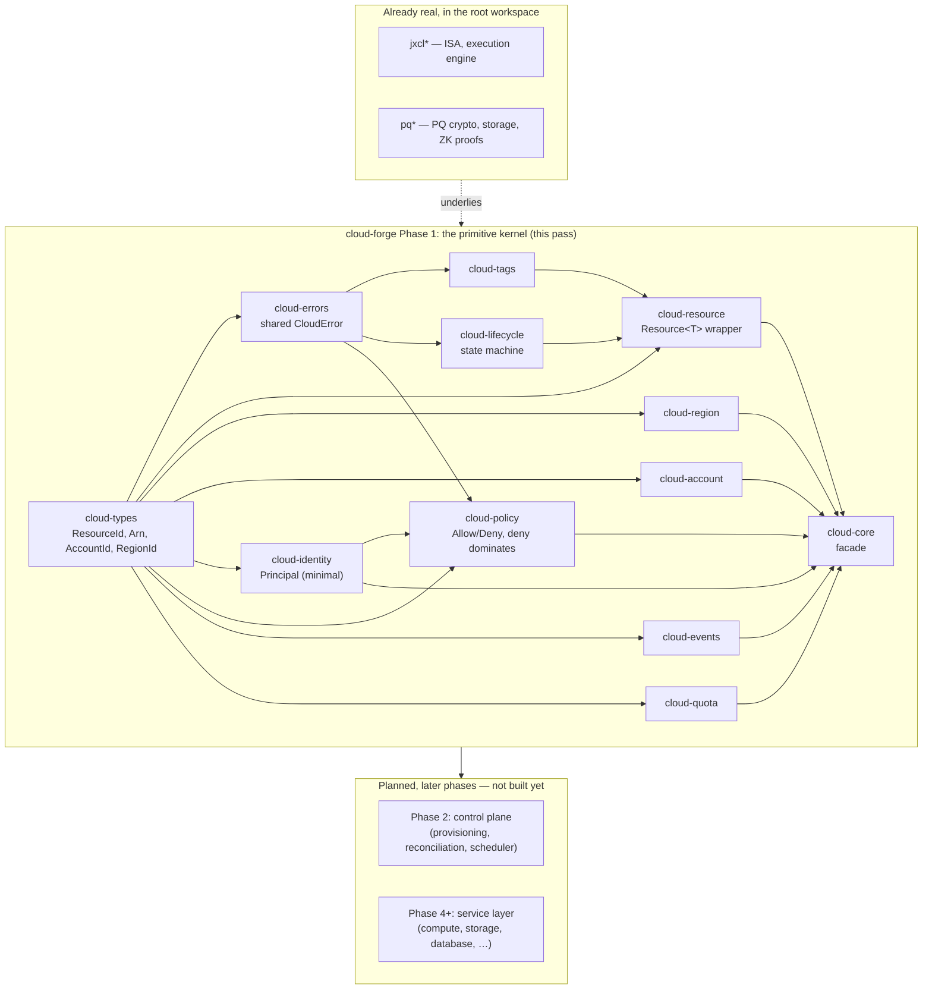

# cloud-forge architecture

## The non-negotiable rule

> Do not create one crate per AWS service. Build the primitives once,
> then compose services from those primitives.

`cloud-forge` is a from-first-principles attempt at the substrate
underneath an AWS-shaped cloud platform: resource identity, lifecycle,
ownership, policy, tagging, events, and quota — the handful of concepts
that every cloud service (compute, storage, database, messaging, …)
reuses rather than reinvents. No crate in this workspace is named after
an AWS product, and none will be until it is a thin composition of
already-real primitive crates, not a container for logic that belongs
in one of them.

This mandate carries the same weight as the root workspace's "100
crates, none of them fake" rule (see the repository root
[`docs/CRATE_ARCHITECTURE.md`](../../docs/CRATE_ARCHITECTURE.md)) and
`verification-forge`'s hard invariants: a crate exists here only when
it owns a real, independently-testable invariant.

## Why a third workspace

`tlm-jxcl-forge` already separates two independent Cargo workspaces:
the root workspace (the TLM JXCL ISA, post-quantum crypto/storage, one
reference service) and `verification-forge` (a from-scratch proof
kernel). Neither is a natural home for cloud-resource modeling:

- The root workspace's `docs/crates.toml` registry is machine-checked
  at exactly 100 crates with its own dependency-DAG rules
  (`tools/check_workspace.py`); folding an open-ended, many-phase cloud
  platform into it would either blow past that validated count or
  force cloud crates to misrepresent themselves as ISA/crypto crates.
- `verification-forge` is a general-purpose proof kernel with no
  cloud-specific concept in it at all — it will eventually *verify*
  invariants about `cloud-forge` (see "Relationship to
  verification-forge" below), which means it must stay independent of
  it, not host it.

So `cloud-forge/` is a third, independent top-level Cargo workspace,
with its own `Cargo.toml`, `crates/`, and quality gates — exactly the
same shape as `verification-forge/`.

## Layering



Every arrow above is a real `[dependencies]` edge in a crate's own
`Cargo.toml` — there is no crate in this phase that depends on
something not yet built, and no crate that exists only to be depended
on later without doing anything itself today.

## The resource model (Phase 0 / Phase 1)

Every cloud resource, regardless of which future service creates it,
carries the same fields — this is the one model every service composes
from rather than redefining:

| Field | Type | Owning crate |
|---|---|---|
| `id` | `ResourceId` | `cloud-types` |
| `resource_type` | `ResourceType` | `cloud-types` |
| `region` | `RegionId` | `cloud-types` / `cloud-region` |
| `account` | `AccountId` | `cloud-types` / `cloud-account` |
| `owner` | `AccountId` | `cloud-types` |
| `lifecycle` | `Lifecycle` | `cloud-lifecycle` |
| `version` | `u64` | `cloud-resource` |
| `tags` | `Tags` | `cloud-tags` |
| `created_at` / `updated_at` | `u64` (unix millis) | `cloud-resource` |

`owner` here means *account ownership* (who a resource bills to and
belongs to) — distinct from `cloud-identity::Principal`, which
`cloud-policy` evaluates access for. A resource-based policy attaching
a `Principal` to a specific resource is a Phase 13 (IAM) concept, not
pulled forward into this phase's `Resource<T>`.

`cloud-resource::Resource<T>` combines all of these plus a
service-specific payload `T`, so a future `Instance` or `Bucket` type
is `Resource<InstanceSpec>` / `Resource<BucketSpec>`, not a
hand-rolled struct that has to remember to include `tags` and
`lifecycle` correctly on its own.

The internal ARN format `cloud-types::Arn` implements is exactly the
one specified in the roadmap:

```
jxcl:cloud:<partition>:<service>:<region>:<account>:<resource>
```

## What Phase 1 deliberately does not include

- **`cloud-metadata` is not a separate crate.** Its proposed fields
  (`created_at`/`updated_at`/tags/version) are exactly `cloud-resource`
  and `cloud-tags`'s fields; a separate crate would own nothing a
  caller couldn't already get from those two.
- **`cloud-runtime` is deferred past Phase 2 too, now to Phase 4
  (compute primitives).** Phase 2 does add a scheduler, but what it
  schedules is *placement* (which `AzId` a resource is assigned to) —
  a decision `cloud-scheduler` owns directly using `cloud-types`'s
  existing `AzId`, with no new wrapper type needed. A "runtime" only
  becomes a real, distinct primitive once something is actually
  executing (a VM, a container, a function invocation) — Phase 4's
  concern, not Phase 2's.
- **`cloud-identity` is intentionally minimal in this phase**: a
  `Principal` enum (`User`/`Role`/`Service`, each carrying an id) —
  enough for `cloud-policy` to evaluate against. The full IAM surface
  (credentials, sessions, federation, policy documents-as-JSON) is
  Phase 13 in the roadmap and is not pulled forward.
- **No AWS-named crate exists anywhere in this phase.** `services/ec2`,
  `services/s3`, etc. cannot be started honestly until the primitives
  they'd compose (compute, storage, network primitives — later phases)
  are themselves real.

## Phase 2: the control plane

Phase 2 is where Phase 1's primitives stop being independent data
types and start composing into an actual pipeline: a request to create
a resource gets authorized, checked against quota, placed somewhere,
constructed, and recorded — with the whole operation succeeding
atomically or rolling back cleanly. This is also where the roadmap's
deterministic state machine

```
REQUEST -> AUTHENTICATE -> AUTHORIZE -> VALIDATE -> PLAN -> APPLY -> VERIFY -> COMMIT -> AUDIT
```

becomes a real, tested code path rather than a diagram. (`AUTHENTICATE`
is not separately modeled here: this phase takes an already-resolved
`Principal` as input, since credential/session verification is Phase
13's IAM surface, not Phase 2's control-plane concern.)

### What's real in Phase 2

| Crate | Owns |
|---|---|
| `cloud-scheduler` | Placement: picks the least-loaded `AzId` in a region, from `cloud-region`'s registry and a caller-supplied usage count per AZ |
| `cloud-service-registry` | A registry of named control-plane services and their health (`Healthy`/`Unhealthy`/`Unknown`) |
| `cloud-reconciler` | Given a current and a desired `Lifecycle`, computes the shortest valid transition path through `cloud-lifecycle`'s state graph (via BFS), or reports the desired state as unreachable |
| `cloud-provisioner` | The `AUTHORIZE -> VALIDATE -> PLAN -> APPLY -> VERIFY -> COMMIT -> AUDIT` pipeline itself, composing `cloud-policy` + `cloud-quota` + `cloud-scheduler` + `cloud-resource` + `cloud-events`, with each stage's failure distinguishable and every reservation made by an earlier stage rolled back if a later stage fails |
| `cloud-control-plane` | `ControlPlane<T>`: holds the account/region registries, policy, quota tracker, event log, and a resource store; exposes `create` (via `cloud-provisioner`), `get`, `list`, `delete` |

### What Phase 2 deliberately skips or defers

- **`resource-manager`, `lifecycle-manager`, `quota-manager`,
  `policy-engine`, `account-manager`, `region-manager` are not separate
  crates.** Each would be a thin wrapper doing nothing but forwarding
  to `cloud-resource`, `cloud-lifecycle`, `cloud-quota`, `cloud-policy`,
  `cloud-account`, or `cloud-region` — exactly the one-crate-per-name
  anti-pattern this workspace's non-negotiable rule exists to prevent.
  `cloud-control-plane` holds these Phase 1 primitives directly instead
  of through an extra indirection layer that owns nothing new.
- **`control-api` (a REST/gRPC layer) is deferred.** The roadmap's own
  execution order puts the API layer (Phase 30) well after the control
  plane it exposes; building an HTTP surface before the control plane
  it would serve is stable is building a service, not a primitive.
- **`cloud-runtime` is deferred to Phase 4** — see above.

### The rollback invariant

`cloud-provisioner`'s pipeline makes a real claim worth stating
explicitly: if `AUTHORIZE` succeeds but a later stage (`VALIDATE`,
`PLAN`, `APPLY`, or `COMMIT`) fails, every resource reservation an
earlier stage made (currently: `cloud-quota` usage) is released before
the pipeline returns its error. This is tested directly — not inferred
from "the individual stages are each atomic" — since a multi-stage
pipeline built from atomic parts is not itself atomic unless someone
wires the rollback path and verifies it.

## Definition of done, per crate

Reusing the roadmap's own maturity levels, scoped to what a primitive
crate (not a service) can claim:

- **L1 (data model)** — the types exist, are validated at construction,
  and round-trip through their own `Display`/`FromStr` (or equivalent).
- **L2 (deterministic local implementation)** — the crate's actual
  logic (a state-machine transition, a policy evaluation, a quota
  check) is implemented and produces the same result for the same
  input every time, with no hidden clock/randomness/iteration-order
  dependency.
- **L8 (tests)** — every invariant claimed above has a passing test
  that would fail if the invariant were violated (not just a
  compiles-and-returns-something test).

Every crate in this phase targets L1+L2+L8. Persistence (L5),
distribution (L4), and formal verification (L9/L10, eventually via
`verification-forge`) are explicitly out of scope until the control
plane (Phase 2) gives them something real to attach to.

## Relationship to `verification-forge`

Per the roadmap: `verification-forge` should eventually verify
`cloud-forge`'s invariants (resource-id uniqueness, deny-dominates
policy evaluation, lifecycle transitions being total functions, quota
violations never committing), not become a runtime dependency of it.
That work is not started in this phase — it requires `cloud-forge`'s
own resource/lifecycle/policy model to exist and stabilize first, which
is exactly what this phase builds.

## Quality gates

Same discipline as the other two workspaces in this repository: no
crate is considered done until `cargo test -p <crate> --release`
passes, `cargo clippy -p <crate> --all-targets -- -D warnings` is
clean, and `cargo fmt -p <crate> -- --check` is clean — checked after
every crate, not batched at the end. `#![forbid(unsafe_code)]` in every
crate. No `unwrap()`/`expect()` on anything derived from a caller's
input -- a malformed resource id or an invalid policy input is exactly
the kind of thing this substrate has to reject cleanly (a `CloudError`)
rather than panic on. The only `expect()` calls in this phase
(`cloud-region`'s AZ-name construction, `cloud-types::AzId::region()`)
are on values built from a *already-validated* piece of the same type's
own state -- provably unreachable to fail, and each carries a comment
saying so -- never on anything a caller supplied that hasn't already
gone through that type's constructor.
