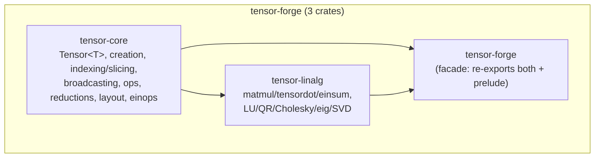

# tensor-forge


An arbitrary-rank tensor library built directly on
[`ndarray`](https://docs.rs/ndarray), covering creation, indexing and
slicing (negative indices and steps included), broadcasting, elementwise
arithmetic, reductions, memory layout control, `einops`-style
`rearrange`/`reduce`/`repeat`, `matmul`/`tensordot`/a reference `einsum`,
and pure-Rust LU/QR/Cholesky/Jacobi-eigenvalue/SVD decompositions. This
is a **separate Cargo workspace** from the rest of this repository's
100-crate `jxcl`/`pq-*` stack and from `verification-forge` and
`cloud-forge` — nothing here depends on any of them, and none of them
depend on this.

## Quickstart

```rust
use tensor_forge::prelude::*;

// Creation, elementwise ops, broadcasting.
let a = Tensor::from_vec(&[2, 3], vec![1.0, 2.0, 3.0, 4.0, 5.0, 6.0])?;
let b = Tensor::from_vec(&[3], vec![10.0, 20.0, 30.0])?;
let c = &a + &b; // broadcasts the length-3 row over both rows of `a`

// Negative-index, strided slicing that ndarray's `s![]` macro can't do
// at runtime (its axis count is fixed at compile time).
let last_col = a.slice_dyn(&[SliceSpec::full(), SliceSpec::Index(-1)])?;

// Reductions.
let row_means = a.mean_axis(1)?;

// einops-style rearrange: NHWC -> NCHW.
let images = Tensor::<f64>::zeros(&[8, 32, 32, 3]);
let nchw = rearrange(&images, "b h w c -> b c h w", &Default::default())?;

// Linear algebra.
let m = Tensor::from_vec(&[2, 2], vec![4.0, 1.0, 1.0, 3.0])?;
let rhs = Tensor::from_vec(&[2], vec![1.0, 2.0])?;
let x = solve(&m, &rhs)?;
let QrDecomposition { q, r } = qr(&m)?;
```

## Crate layout



| Crate | What it owns |
|---|---|
| [`tensor-core`](./crates/tensor-core) | The `Tensor<T>` type itself: creation (`zeros`/`ones`/`full`/`eye`/`arange`/`linspace`/`from_shape_fn`/`from_vec`/`random*`), dynamic-rank slicing (`slice_dyn`, negative indices, steps), broadcasting, elementwise arithmetic and math ops, reductions (`sum`/`mean`/`max`/`min`/`argmax`/`argmin`/`var`/`std`, all with axis variants), transpose/permute/reshape/squeeze, C/Fortran memory layout conversion, and `einops`-style `rearrange`/`reduce`/`repeat`. |
| [`tensor-linalg`](./crates/tensor-linalg) | `matmul` (vector/matrix/batched), `tensordot`, a reference `einsum`, and pure-Rust `lu`/`solve`/`det`/`inverse`, `qr` (Householder), `cholesky`, `eig_symmetric` (cyclic Jacobi), `svd` (one-sided Jacobi). |
| [`tensor-forge`](./crates/tensor-forge) | The facade: depend on this one crate to get both, plus `tensor_forge::prelude::*`. |

## Feature flags

All optional and off by default; enable on whichever crate you depend on
directly (the `tensor-forge` facade forwards each one to `tensor-core`).

| Feature | Adds |
|---|---|
| `rand` | `Tensor::random`, `random_uniform`, `random_normal`, via `ndarray-rand` + `rand`/`rand_distr`. |
| `parallel` | `Tensor::par_mapv`/`par_mapv_inplace`/`par_for_each_outer`, via `ndarray`'s own `rayon` feature. |
| `serde` | `Serialize`/`Deserialize` for `Tensor<T>`, delegating to `ndarray`'s own `serde` support. |

## Design notes and deliberate scope limits

- **Dynamic rank by default.** `Tensor<T>` wraps `ndarray::ArrayD<T>`
  (`Array<T, IxDyn>`) rather than being generic over a dimension type.
  Real-world shapes are usually only known at runtime, and converting to
  and from a statically-ranked `ndarray::Array<T, D>` is zero-cost
  (`Tensor::from_owned` / `Tensor::into_dimensionality::<D>()`) for the
  call sites where the rank *is* known at compile time.
- **Decompositions are textbook pure-Rust, not LAPACK.** `lu`/`qr`/
  `cholesky`/`eig_symmetric`/`svd` are partial-pivoted Gaussian
  elimination, Householder reflections, and cyclic/one-sided Jacobi
  rotations — correct and dependency-free, but `O(n^3)` per sweep/pass
  without the blocking, cache-tiling, or multithreading a production
  LAPACK gets from decades of tuning. For large dense linear algebra,
  wire in [`ndarray-linalg`](https://docs.rs/ndarray-linalg) (OpenBLAS/
  MKL/Netlib backends) or [`faer`](https://docs.rs/faer) behind your own
  feature flag instead of reaching for these; they're sized for
  correctness-critical small-to-medium problems and for being read.
- **`eig_symmetric` is symmetric-only.** General (non-symmetric,
  possibly complex-eigenvalue) eigendecomposition needs a shifted QR
  algorithm with complex-pair handling that's a materially bigger
  undertaking; symmetric Jacobi is the common case (covariance/Gram
  matrices, graph Laplacians, Hessians near a minimum) and is
  guaranteed to converge, which a naive unshifted general QR iteration
  is not.
- **`einsum` is a correctness-first reference implementation.** It
  evaluates any `"ij,jk->ik"`-style pattern over any number of operands
  by iterating the full Cartesian product of every distinct index's
  size — `O(product of all operand dimensions)`, with no contraction-
  order optimization. `matmul` and `tensordot` (which reduce to one
  `ndarray` `.dot()` call via a permute-reshape-multiply, so they get
  `ndarray`'s `matrixmultiply`-backed performance) are the ones to
  reach for on a hot path; use `einsum` for readability/correctness on
  contractions those don't cover, or as a reference to check a faster
  path against.
- **Batched `matmul` doesn't broadcast batch dimensions.** `a`'s and
  `b`'s leading (all-but-last-two) axes must match exactly; NumPy-style
  batch broadcasting (`(4,1,3,2) @ (5,2,6)`-shaped inputs) isn't
  implemented.
- **No GPU backend.** Everything here runs on the CPU; `parallel` gets
  you `rayon`-based multithreading, not a `candle`/`tch`-style device
  abstraction. If you need one, this crate's `Tensor<T>` is a reasonable
  CPU reference implementation to check a GPU path's numerics against.

## Testing

66 tests (unit + integration, spread across all three crates) plus one
doctest, covering: every creation function; slicing with negative
indices, steps, and multi-axis specs; broadcasting arithmetic and its
error paths; every reduction (including axis variants and the
population/sample-variance distinction); layout round-tripping (C ↔
Fortran order preserves logical values); every `einops` pattern kind
(permute, split, merge, reduce, repeat with both a named and a literal
new-axis size) plus its error paths; `matmul` across all of NumPy's
rank combinations plus the batched case; `tensordot` cross-checked
against `matmul` on the case where they agree; `einsum` on matmul,
transpose, trace, and diagonal-extraction patterns; and every
decomposition verified by reconstructing the original matrix (`P A = L
U`, `Q R = A` with `Q` orthogonal, `L L^T = A`, `A v = \lambda v` for
each eigenpair, `U \Sigma V^T = A`) rather than by comparing against a
hardcoded "expected" answer, plus their error paths (singular,
non-symmetric, non-positive-definite input).

```sh
cargo test --workspace --all-features
cargo clippy --workspace --all-targets --all-features -- -D warnings
cargo fmt --all -- --check
```
