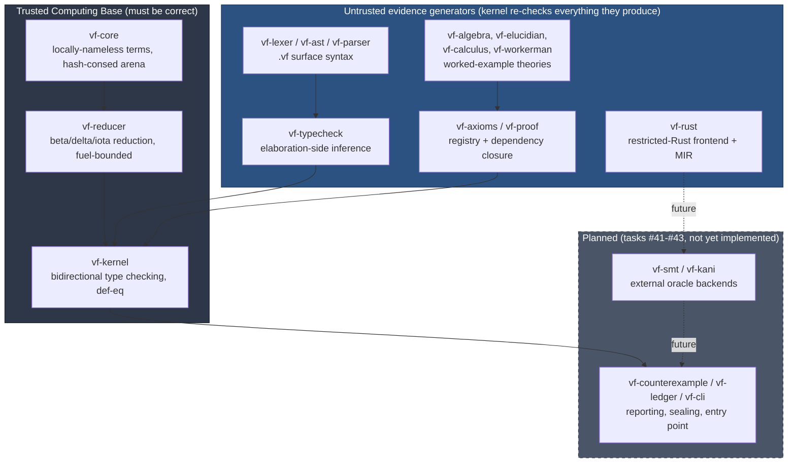
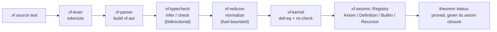
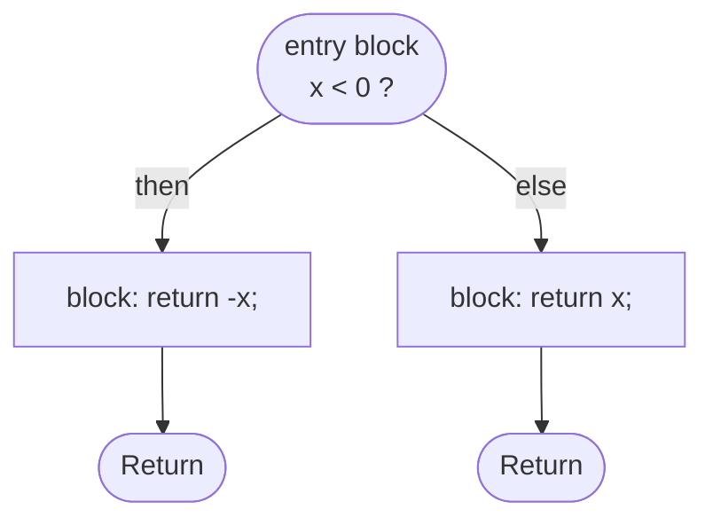

# verification-forge


A from-scratch, Lean4/Kani-inspired formal verification system, written
entirely in Rust, with no `unsafe`, no third-party proof-checking
dependency, and no shortcut where a computation is treated as a proof
just because it typechecked. It is a **separate Cargo workspace** from
the rest of this repository's 100-crate `jxcl`/`pq-*` stack — nothing
here depends on, or is depended on by, that workspace.

> **Read this before anything else:** this project defines two
> playfully-named theories, **"Elucidian Algebra"** (`vf-elucidian`)
> and **"Workerman's Calculus"** (`vf-workerman`), as small worked
> examples of the kernel proving real theorems about hand-picked
> operations. **Neither is an established mathematical or scientific
> discipline.** They are original names invented for this codebase,
> not references to any pre-existing body of work, and every theorem
> proved under them is exactly as strong as its own proof term — no
> stronger, and not "backed" by any external theory of that name. Every
> module that defines them repeats this disclaimer in its own doc
> comment so it can never be read as a real citation out of context.

## Table of contents

- [What this is (and is not)](#what-this-is-and-is-not)
- [How this compares to Lean4, Coq, and Kani](#how-this-compares-to-lean4-coq-and-kani)
- [The hard invariants](#the-hard-invariants)
- [Architecture: the trusted kernel and everything else](#architecture-the-trusted-kernel-and-everything-else)
- [Pipeline: from source text to a checked theorem](#pipeline-from-source-text-to-a-checked-theorem)
- [Crate index](#crate-index)
- [Key design decisions](#key-design-decisions)
- [Worked example: proving `n + 0 = n` by induction](#worked-example-proving-n--0--n-by-induction)
- [vf-rust: a restricted-Rust verification frontend](#vf-rust-a-restricted-rust-verification-frontend)
- [The `.vf` axiom registry, in detail](#the-vf-axiom-registry-in-detail)
- [Known, documented limitations](#known-documented-limitations)
- [Status and roadmap](#status-and-roadmap)
- [Building and testing](#building-and-testing)
- [Glossary](#glossary)
- [Frequently asked questions](#frequently-asked-questions)
- [License](#license)

## What this is (and is not)

`verification-forge` is a dependently-typed proof kernel (in the LCF
tradition: a small trusted core, everything else untrusted) plus a
handful of layers built on top of it: a surface syntax and parser for a
`.vf` theorem language, an axiom/definition registry, a library of
inductive types and their eliminators, two small worked-example
theories, and a frontend for a restricted subset of Rust intended as
the eventual input language for program verification (Kani-style).

It is **not** a reimplementation of Lean4, Coq, or Kani — it borrows
their *shape* (a trusted kernel that never trusts its own elaborator; a
locally-nameless term representation; bidirectional type checking;
axioms that must be declared, never assumed) at a fraction of the
scope, and it does not claim feature parity with any of them. It is
also, as the box above says, **not** a source of new mathematics: the
theorems it proves are genuine (checked by the kernel, not asserted),
but the theories organizing them (`Elucidian Algebra`, `Workerman's
Calculus`) are this project's own invented scaffolding, not
established fields.

## How this compares to Lean4, Coq, and Kani

This project borrows ideas from three very different, much larger
systems. Being explicit about what's borrowed and what isn't is part
of the same honesty policy that governs the axiom registry:

| | Lean4 / Coq | AWS Kani | `verification-forge` |
|---|---|---|---|
| Kernel size | Small trusted core, large elaborator | N/A (model checker, not a proof kernel) | Small trusted core (`vf-core`+`vf-reducer`+`vf-kernel`), ~2,250 lines total |
| Term representation | Named or de Bruijn, varies by implementation | N/A | Locally-nameless (de Bruijn bound, interned free), hash-consed |
| What it proves | Arbitrary dependently-typed mathematics | Absence of panics/overflow/UB in real Rust, via bounded model checking + an SMT solver | Whatever is stated and proved via its own inductive types and eliminators — currently arithmetic and two worked-example theories |
| Universe polymorphism | Yes | N/A | **No** (documented limitation — see below) |
| Program verification input | N/A (not a program verifier) | Real, unrestricted Rust | A deliberately restricted Rust subset (`vf-rust`) — i64/bool only, no interprocedural analysis yet |
| External oracle (SMT/model checker) | Lean4: none in the trusted core; Coq: none | Yes — CBMC + an SMT backend | Planned (`vf-smt`/`vf-kani`, task #41), not yet implemented |
| Maturity | Production, decades of development | Production, actively maintained by AWS | A from-scratch educational/experimental project built in one continuous session |

The honest summary: this is a small proof kernel built to understand
and demonstrate the *shape* of systems like these — the same
discipline (never trust the elaborator, never assert without a
checked term, always know your axiom closure), at a small fraction of
the scope and none of the production maturity.

## The hard invariants

These rules govern every crate in this workspace and are treated as
non-negotiable, not aspirational:

1. **Rust only.** No FFI into another verifier, no shelling out to an
   external proof assistant as the source of truth.
2. **No `unsafe` unless isolated behind a documented boundary.** 20 of
   this workspace's 21 crates carry `#![forbid(unsafe_code)]` outright;
   none contains a single `unsafe` block today.
3. **No `unwrap()`/`expect()` in verifier-critical paths.** Every
   fallible operation in the kernel, reducer, typechecker, and parser
   returns a `Result`; a malformed or unprovable input is a value to
   inspect, never a panic.
4. **Fail closed.** When the kernel or reducer cannot decide something
   (fuel exhausted, a construct it doesn't recognize), it *rejects*,
   it never optimistically accepts.
5. **Deterministic output.** Term interning, reduction, and type
   checking never depend on hash-map iteration order or wall-clock
   time; the same input always produces the same `TermId`s and the
   same verdict.
6. **Every theorem and proof has explicit identity.** Nothing is
   proved anonymously — everything lives under a named `Symbol` in a
   registry, traceable back to its declaration.
7. **Every axiom is explicitly registered, and axioms are never
   introduced silently.** `vf_axioms::Registry` distinguishes
   `Axiom` (asserts something that could be false), `Definition`,
   `Builtin`, and `Recursor` entries; only `Axiom` entries count
   against an `AxiomPolicy`, and a dependency closure can always answer
   "what axioms does this theorem actually rest on?"
8. **An unverified computation is never treated as a proof.** A `.vf`
   file that merely evaluates something is not evidence of anything
   the kernel hasn't independently re-derived.
9. **Strict layer separation.** Syntax, elaboration, typing, reduction,
   proof-checking, model-checking, SMT translation, theorem status, and
   (eventually) cryptographic sealing are separate crates with explicit
   interfaces — never one file doing all of it.
10. **The kernel never trusts its own elaborator.** Anything upstream
    of `vf-kernel` is, by construction, an "evidence generator" whose
    output the kernel re-derives and re-checks from first principles,
    not a component whose word is taken.
11. **Small modules, explicit interfaces.** No file is allowed to grow
    into "the one that does everything"; the crate boundaries above
    exist because they force this.
12. **Never proceed to the next layer while the current one's tests are
    failing.** Every crate in this workspace was built, tested,
    linted, and formatted clean before the next one started.

## Architecture: the trusted kernel and everything else



The arrows into `vf-kernel` are the entire point of this diagram:
whatever the parser, elaborator, axiom registry, or a theory crate
hands the kernel, the kernel re-derives from the term structure itself
(normalizing, comparing, re-type-checking) rather than accepting a
verdict computed upstream. A bug in `vf-parser` can produce a term the
kernel *rejects*; it can never make the kernel accept something false,
because the kernel does not consult the parser's opinion at all.

## Pipeline: from source text to a checked theorem



Every one of `Nat_ind`, `Bool_ind`, `refl`, and `ap` in the box above
is a real, kernel-checked construct: adding an inductive type means
registering its constructors *and* a `RecursorSpec` describing how its
eliminator reduces, then proving that reduction is well-typed by
actually running a proof term through the kernel — not by asserting it
works.

## Crate index

| Crate | Role | Lines | Tests | Status |
|---|---|---:|---:|---|
| [`vf-core`](./crates/vf-core) | Locally-nameless term representation, hash-consed `TermArena`, `open_at`/`close_at`/`shift` | 761 | 22 | ✅ Implemented |
| [`vf-ast`](./crates/vf-ast) | Surface AST for the `.vf` theorem language | 97 | 0¹ | ✅ Implemented |
| [`vf-lexer`](./crates/vf-lexer) | Tokenizer for `.vf` source | 419 | 13 | ✅ Implemented |
| [`vf-parser`](./crates/vf-parser) | Recursive-descent parser, `.vf` text → `vf-ast` | 527 | 19 | ✅ Implemented |
| [`vf-typecheck`](./crates/vf-typecheck) | Bidirectional `infer`/`check`, definitional equality | 639 | 13 | ✅ Implemented |
| [`vf-reducer`](./crates/vf-reducer) | Beta/delta/iota reduction, fuel-bounded, generic recursor support | 823 | 15 | ✅ Implemented |
| [`vf-kernel`](./crates/vf-kernel) | The trusted type-checking kernel — the only crate every proof ultimately answers to | 668 | 12 | ✅ Implemented |
| [`vf-proof`](./crates/vf-proof) | Proof-term bookkeeping, dependency closures over the axiom DAG | 458 | 7 | ✅ Implemented |
| [`vf-axioms`](./crates/vf-axioms) | `Registry`, `AxiomPolicy`, and the standard prelude (`Nat`, `Bool`, `List`, `Option`, `Either`, `Vector`, `Fin`, `refl`, `ap`, …) | 1920 | 17 | ✅ Implemented |
| [`vf-algebra`](./crates/vf-algebra) | Reusable algebraic property builders (associative, commutative, idempotent, …) | 291 | 6 | ✅ Implemented |
| [`vf-elucidian`](./crates/vf-elucidian) | "Elucidian Algebra" — worked-example theory, **not** an established discipline | 341 | 3 | ✅ Implemented |
| [`vf-calculus`](./crates/vf-calculus) | Statement builders for evaluation/equivalence/derivative-style claims | 165 | 4 | ✅ Implemented |
| [`vf-workerman`](./crates/vf-workerman) | "Workerman's Calculus" — worked-example theory, **not** an established discipline | 941 | 4 | ✅ Implemented |
| [`vf-rust`](./crates/vf-rust) | Restricted-Rust lexer/parser/MIR-lowering frontend, with `requires`/`ensures`/`invariant`/`decreases` contracts | 1906 | 32 | ✅ Implemented (frontend only — verifies nothing yet) |
| [`vf-elab`](./crates/vf-elab) | Elaboration layer (implicit-argument/metavariable resolution) | 11 | 1 | 🚧 Scaffold |
| [`vf-smt`](./crates/vf-smt) | SMT solver oracle backend | 11 | 1 | 🚧 Scaffold — task #41 |
| [`vf-kani`](./crates/vf-kani) | Bounded model-checking oracle backend | 11 | 1 | 🚧 Scaffold — task #41 |
| [`vf-counterexample`](./crates/vf-counterexample) | Counterexample extraction/reporting | 11 | 1 | 🚧 Scaffold — task #42 |
| [`vf-ledger`](./crates/vf-ledger) | Cryptographic sealing of theorem-status records | 11 | 1 | 🚧 Scaffold — task #42 |
| [`vf-cli`](./crates/vf-cli) | Command-line entry point | 11 | 1 | 🚧 Scaffold — task #42 |
| [`vf-tests`](./crates/vf-tests) | Cross-crate integration + negative-test suite | 11 | 1 | 🚧 Scaffold — task #43 |

¹ `vf-ast` is a pure data-type crate (no logic to unit test beyond what
`vf-parser`'s tests already exercise by construction).

**174 tests pass workspace-wide today** (`cargo test --workspace
--release` from this directory), all `cargo clippy --all-targets -- -D
warnings` clean, all `cargo fmt -- --check` clean.

## Key design decisions

- **Locally-nameless terms.** Bound variables are de Bruijn indices;
  free variables are interned symbols. Combined with hash-consing in
  `TermArena`, this makes alpha-equivalent terms (`fn(x)=>x` and
  `fn(y)=>y`) collapse to the *same* `TermId` — an invariant a real bug
  once violated (see `Binder`'s hand-written `PartialEq`/`Eq`/`Hash`,
  which deliberately ignores the binder's display name) and that a
  regression test now pins down permanently.
- **Bidirectional type checking.** `infer` computes a type from a term;
  `check` verifies a term against an expected type; definitional
  equality (`def_eq`) is decided by normalizing both sides to a fixed,
  fuel-bounded point and comparing structurally.
- **Fuel-bounded reduction, not a strong-normalization proof.** Rather
  than prove this kernel's type theory strongly normalizing (a
  significant metatheoretic undertaking), every reduction carries a
  `DEFAULT_FUEL = 1_000_000` budget and fails closed if it's exhausted.
  This is a deliberate, documented scope trade: it can reject a term
  that *would* have normalized given more fuel, but it can never loop
  forever or accept something unsound.
- **Generic, table-driven iota reduction.** Adding a new inductive
  type's eliminator means writing a `RecursorSpec` (arity, case
  positions, constructor names, and per-constructor `skip`/
  `recursive_args` metadata) — not hand-rolling a new reduction rule in
  the reducer. `skip` exists because a constructor like `cons A x xs`
  binds its uniform type parameter `A` once at the recursor's own top
  level; it is never re-abstracted into each case function.
- **No universe polymorphism (documented limitation).** A `Type`-valued
  motive cannot be reused to prove a `Prop`-valued goal in this kernel,
  so types that need both a computational eliminator and a
  proof-producing one get two: `Bool_rec`/`Bool_ind`,
  `Nat_rec`/`Nat_ind`. The underlying reduction *rule* is sort-agnostic
  and is shared; only the declared *type* differs between the two
  `Const` symbols.
- **`refl` and `ap` as opaque prelude builtins, not a general J-rule.**
  This kernel has no general equality eliminator. Rather than build one
  to prove the two theorems that needed congruence, `ap : Pi(A B :
  Type0)(f : A -> B)(x y : A), Eq(A,x,y) -> Eq(B, f x, f y)` was added
  directly as its own builtin — a narrower, explicitly-scoped choice
  documented at its declaration site.
- **A declare-before-use axiom DAG.** `vf_axioms::Registry` refuses to
  register a constant that references a not-yet-declared one, which
  makes the constant-reference graph a DAG by construction — the
  property `vf_proof::dependency_closure` relies on to answer "what
  does this theorem transitively depend on?" without needing a
  separate cycle check.

## Worked example: proving `n + 0 = n` by induction

`vf-workerman`'s `add_zero_right` (in `crates/vf-workerman/src/arith.rs`)
is the clearest example of the kernel doing real inductive-proof work,
not just checking a computation:

```
add_zero_right : Pi (n : Nat), Eq(Nat, add(n, zero), n)
add_zero_right = fun (n : Nat) =>
    Nat_ind
      (motive := fun (n : Nat) => Eq(Nat, add(n, zero), n))
      (case_zero := refl(Nat, zero))
      (case_succ := fun (n' : Nat) (ih : Eq(Nat, add(n', zero), n')) =>
          ap(Nat, Nat, succ, add(n', zero), n', ih))
      n
```

- The base case (`add(zero, zero) = zero`) is discharged by
  computation alone: both sides reduce to the same normal form, so
  `refl` suffices.
- The inductive step needs more than computation: `add(succ n', zero)`
  reduces to `succ(add(n', zero))`, but that is not yet syntactically
  `succ(n')` — it's `succ` applied to *whatever `add(n', zero)`
  reduces to*, related to `n'` only via the induction hypothesis `ih :
  Eq(Nat, add(n', zero), n')`. Lifting that equality under `succ`
  is exactly what `ap` (congruence) is for.
- `vf-workerman` then goes one step further with `eval_add_zero_right`,
  which *reuses* this already-proved theorem as a lemma inside a second
  proof — the first place in this codebase a proof is built by
  composition rather than from scratch.

Every step of this was validated by actually running the proof term
through `vf-kernel::type_check`, not by inspection — this is precisely
how the `skip` field, the recursor-lookup collision, and the
motive-vs-motive-value bugs described in this project's development
history were caught.

## vf-rust: a restricted-Rust verification frontend

`vf-rust` is a small, independent lexer/parser/IR for a deliberately
narrow subset of Rust — the eventual input language for program
verification, in the spirit of AWS Kani. It shares no code with the
`.vf` theorem language's lexer/parser (the two syntaxes have nothing in
common), and it is a **frontend only**: it does not verify anything
itself. Turning its output into proof obligations is `vf-smt`/
`vf-kani`'s job (task #41, next).

```rust
fn abs(x: i64) -> i64
    requires x != 0
    ensures result >= 0
{
    if x < 0 {
        return -x;
    } else {
        return x;
    }
}
```

`vf_rust::compile(src)` lexes and parses this into a surface AST, then
lowers it to a MIR-like IR modeled on rustc's own: an explicit
control-flow graph of `BasicBlock`s, each a straight-line sequence of
single-operation `Statement::Assign`s to fresh `Local` temporaries,
ending in one `Terminator` (`Goto`, `SwitchInt`, `Return`, or
`Unreachable`). The `if` above becomes a then/else/join diamond; a
`while` loop becomes a header/body/exit shape with a back-edge, and its
`invariant`/`decreases` clauses are recorded on the header block rather
than lowered into more control flow — a future verifier needs them as
*statements to prove*, not as executable code.



`requires`/`ensures` are kept as un-lowered surface expressions on
`mir::Function` (and may reference the special `result` expression,
only valid inside a contract) — again, so they stay statements to prove
rather than being compiled away.

For reference, the restricted-Rust grammar `vf-rust` accepts (see
`parser.rs`'s own doc comment for the authoritative version):

```
program        ::= function*
function       ::= "fn" ident "(" params? ")" ("->" ty)?
                    requires* ensures* block
params         ::= param ("," param)*
param          ::= ident ":" ty
ty             ::= "i64" | "bool"
requires       ::= "requires" expr
ensures        ::= "ensures" expr
block          ::= "{" stmt* "}"
stmt           ::= "let" "mut"? ident (":" ty)? "=" expr ";"
                  | ident "=" expr ";"
                  | "if" expr block ("else" block)?
                  | "while" expr invariant* decreases? block
                  | "return" expr? ";"
                  | expr ";"
invariant      ::= "invariant" expr
decreases      ::= "decreases" expr
expr           ::= logic_or
logic_or       ::= logic_and ("||" logic_and)*
logic_and      ::= equality ("&&" equality)*
equality       ::= comparison (("==" | "!=") comparison)*
comparison     ::= additive (("<" | "<=" | ">" | ">=") additive)*
additive       ::= multiplicative (("+" | "-") multiplicative)*
multiplicative ::= unary (("*" | "/" | "%") unary)*
unary          ::= ("-" | "!") unary | primary
primary        ::= int_lit | "true" | "false" | "result" | ident
                  | ident "(" (expr ("," expr)*)? ")"
                  | "(" expr ")"
```

The precedence chain (`logic_or` → … → `unary` → `primary`) matches
ordinary arithmetic/logical conventions: `1 + 2 * 3` parses as `1 + (2
* 3)`, and `a || b && c` parses as `a || (b && c)` — both pinned down
by dedicated parser tests rather than left to chance.

## The `.vf` axiom registry, in detail

`vf-axioms::Registry` is where every constant in the system — every
axiom, definition, builtin, and recursor — gets its one canonical
declaration. Four entry kinds, and only one of them is a liability:

- **`Axiom`** — asserts something that could, in principle, be false
  (nothing checks it; it's taken on faith). The *only* entry kind that
  counts against an `AxiomPolicy`.
- **`Definition`** — introduces a name for a term the kernel has
  already type-checked; it asserts nothing beyond what its own body
  already proves.
- **`Builtin`** — a primitive the kernel treats as a base case (`refl`,
  `ap`, the inductive types' constructors) — not derived from anything
  more primitive within this system, but not an unverified assumption
  either, since its *typing rule* is what the kernel checks every use
  against.
- **`Recursor`** — an eliminator (`Nat_rec`, `Bool_ind`, …), whose
  reduction behavior is checked against its own `RecursorSpec` rather
  than assumed.

`AxiomPolicy` then governs what's allowed to be registered at all:

- **`NoAxioms`** — reject any `Axiom` entry outright; everything must
  bottom out in `Builtin`/`Recursor`/`Definition`.
- **`ExplicitAxiomsOnly`** — axioms are allowed, but only ones
  registered through the explicit axiom-declaration path (never
  introduced as a side effect of something else).
- **`Unrestricted`** — no policy check (used sparingly, mainly for
  exploratory work, never for a theorem meant to be trusted).

Because `Registry` refuses to register a constant that references a
name not yet declared, the whole constant-reference graph is a DAG by
construction — there is no separate cycle-detection pass. This is what
lets `vf_proof::dependency_closure` answer, for any theorem, the
question that actually matters for trusting it: *which axioms, if any,
does this rest on, transitively?* A theorem with an empty axiom closure
is proved outright; one that depends on a registered `Axiom` is only as
trustworthy as that axiom.

## Known, documented limitations

These are recorded as deliberate scope choices, not bugs, at their
respective declaration sites:

- **No universe polymorphism** in `vf-kernel` (see above).
- **Fuel-bounded reduction**, not a proven-strongly-normalizing type
  theory — a fail-closed engineering substitute for a metatheory proof
  this project does not attempt.
- **No general equality eliminator (J-rule)** — only `refl` and `ap`
  are provided, because those are the two primitives every proof in
  this codebase so far has actually needed.
- **Per-crate helper duplication** (`dep_pi`/`arrow`/`lam1`/`app2..4`
  term-building helpers are reimplemented in `vf-algebra`,
  `vf-axioms::prelude`, `vf-elucidian`, `vf-calculus`, and
  `vf-workerman` rather than factored into a shared crate) — a
  conscious small-modules-over-coupling trade, at the cost of some
  repeated boilerplate.
- **`vf-rust` only models `i64` and `bool`**, has no structs, arrays,
  references, or generics, does not analyze calls interprocedurally (a
  call's result is an unconstrained fresh value), and parses/carries
  `decreases` measures without checking that they actually decrease —
  there is no termination checker yet.

## Status and roadmap

| Task | Scope | Status |
|---|---|---|
| #31–#39 | Workspace scaffold through the `vf-algebra`/`vf-elucidian`/`vf-calculus`/`vf-workerman` theory layers | ✅ Done |
| #40 | `vf-rust`: restricted Rust + MIR-like IR | ✅ Done |
| #41 | `vf-smt` + `vf-kani`: external oracle backends | 🚧 Next |
| #42 | `vf-counterexample` + `vf-ledger` + `vf-cli` | ⏳ Pending |
| #43 | Full test suite, negative tests, docs, final workspace gates | ⏳ Pending |

## Building and testing

```
cd verification-forge
cargo build --workspace
cargo test --workspace --release
cargo clippy --workspace --all-targets -- -D warnings
cargo fmt --all -- --check
```

Per-crate, e.g.:

```
cargo test -p vf-kernel --release
cargo test -p vf-rust --release
```

This workspace is independent of the root `Cargo.toml` at the
repository root — building or testing the rest of this repository
(`cargo test --workspace` from the repository root) does not touch
`verification-forge`, and vice versa. See the [repository root
README](../README.md) for how this fits into the rest of the project.

## Glossary

A handful of terms used throughout this README and the codebase's own
doc comments, for readers coming from outside the proof-assistant
world:

- **TCB (Trusted Computing Base)** — the minimal set of code that must
  be correct for the whole system's guarantees to hold. Here: `vf-core`
  + `vf-reducer` + `vf-kernel`. Every other crate can have a bug
  without making the kernel accept something false — at worst it
  produces a term the kernel then correctly rejects.
- **Locally nameless** — a term representation where *bound* variables
  are de Bruijn indices (position-based, so alpha-equivalent terms are
  syntactically identical) but *free* variables keep an actual name
  (an interned `Symbol`). Avoids de Bruijn's own well-known
  substitution-arithmetic bugs for the free-variable case while still
  getting alpha-equivalence for bound variables for free.
- **Hash-consing** — storing each distinct term exactly once in an
  arena and handing out a small integer (`TermId`) as its handle, so
  structurally (and, here, alpha-) equal terms always share the same
  id. Makes equality checks and memoization O(1) instead of requiring
  a structural walk.
- **Definitional equality (`def_eq`)** — two terms are definitionally
  equal if they reduce to the same normal form, as opposed to
  *propositional* equality (an `Eq` term someone has to explicitly
  prove). The kernel's type checker uses `def_eq` internally when
  deciding whether a term has an expected type; `refl` is how a
  program proves definitional equality *as* a term other proofs can
  use.
- **Motive** — in `P_ind`/`P_rec motive case_1 case_2 ... major`, the
  `motive` is the (possibly type-valued, possibly proposition-valued)
  function describing *what's being proved or computed* for each
  constructor case; the eliminator's whole signature is generic in it.
- **Iota reduction** — the reduction rule for eliminators: applying a
  recursor to a fully-applied constructor reduces to the matching case
  function applied to the constructor's own (non-uniform) arguments,
  plus recursively-computed results for any recursive arguments. This
  is what makes `Nat_rec motive z s (succ (succ zero))` actually
  compute, rather than sitting stuck.
- **Fuel** — an explicit, decrementing step budget threaded through
  reduction so that a non-terminating (or merely very large)
  computation fails closed with an error instead of hanging forever.
- **Axiom closure** — the transitive set of `Axiom`-kind registry
  entries a given theorem's proof term actually depends on, computed
  by `vf_proof::dependency_closure`. An empty closure means the
  theorem is proved outright, with nothing taken on faith.

## Frequently asked questions

**Is this a real theorem prover I can use for my own proofs?** It is a
real, working kernel — every theorem shown in this README was checked
by it, not asserted — but its surface language, standard library, and
tooling are a small fraction of what a production system like Lean4 or
Coq offers. Treat it as a demonstration of the architecture, not a
drop-in replacement for either.

**Why does adding an inductive type mean writing a `RecursorSpec`
instead of just pattern-matching in Rust?** Because the kernel must
never trust its own elaborator (invariant #10 above): the reduction
rule for an eliminator has to be data the *kernel itself* interprets
uniformly, not a bespoke `match` arm hidden in a Rust function that the
kernel would have to take on faith. A table-driven `RecursorSpec` keeps
"how does this eliminator reduce" inside the same trusted, generic
machinery every other recursor goes through.

**What happens if a proof runs out of fuel?** `vf-reducer` returns an
error rather than looping forever or silently declaring success — see
invariant #4 (fail closed). A term that needs more than
`DEFAULT_FUEL = 1_000_000` reduction steps to normalize is rejected,
not accepted on a technicality.

**Can `vf-rust` verify a real Rust crate today?** No — it can lex,
parse, and lower a small restricted subset (`i64`/`bool`, `if`/`while`,
calls, contracts) into an IR, but nothing in this workspace yet
discharges the resulting proof obligations. That's `vf-smt`/`vf-kani`
(task #41), still pending.

**Where do I report a bug in the kernel itself?** Given the amount of
this codebase's own testing methodology that consists of "write a
proof term and see if the kernel accepts or rejects it correctly," the
most useful bug report is a minimal `.vf` (or `vf-rust`) program that
the kernel accepts when it should reject, or vice versa — exactly the
shape of the regression tests already in each crate's `#[cfg(test)]`
module.

## License

This workspace is dual-licensed, identically to the repository root:
the GNU Affero General Public License v3.0
([`LICENSE-AGPL`](./LICENSE-AGPL)), or a separately negotiated
commercial license ([`LICENSE-COMMERCIAL`](./LICENSE-COMMERCIAL), a
non-binding draft template). See [`LICENSE-NOTICE`](./LICENSE-NOTICE),
[`COPYRIGHT.md`](./COPYRIGHT.md), and [`TRADEMARKS.md`](./TRADEMARKS.md)
for the copyright holder, licensing contacts, and trademark terms. This
workspace carries its own copy of the license set so it can be
distributed independently of the root repository.
